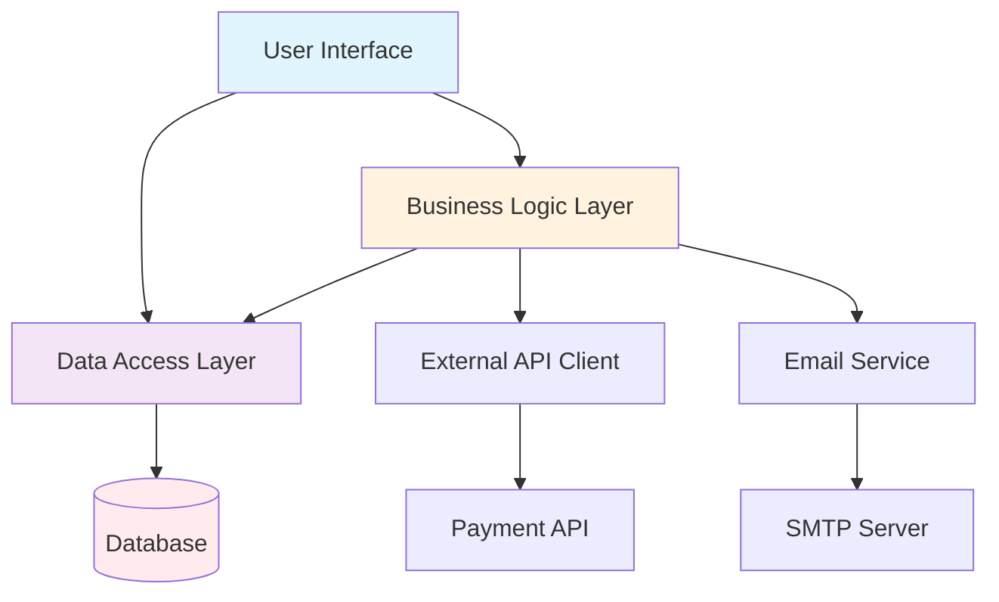

## Chapter 4: Breaking Dependencies with AI Assistance

Legacy code is often difficult to work with because everything is connected to everything else. Breaking these dependencies is essential for making the code testable, maintainable, and modular. AI can help identify dependencies, suggest refactoring strategies, and even automate parts of the dependency-breaking process.

### Dependency Analysis and Visualization

Understanding the dependency structure of legacy code is the first step toward breaking it apart safely. AI can provide insights that would take human analysts weeks to discover manually.

#### AI-Generated Dependency Graphs

AI can analyze codebases and create visual representations of dependencies at various levels of detail.

**System-Level Dependencies**:


**Class-Level Dependencies**:
AI can identify specific classes that have too many dependencies or are depended upon by too many other classes.

```
Dependency Analysis Report:

High Fan-Out Classes (depend on many others):
- OrderProcessor: 23 dependencies
- UserManager: 19 dependencies  
- ReportGenerator: 17 dependencies

High Fan-In Classes (many others depend on them):
- DatabaseConnection: used by 34 classes
- ConfigurationManager: used by 28 classes
- Logger: used by 26 classes

Circular Dependencies Detected:
- OrderService ↔ CustomerService ↔ InventoryService
- EmailTemplate ↔ UserPreferences ↔ NotificationSettings
```

#### Circular Dependency Detection

Circular dependencies are particularly problematic in legacy systems. AI can not only detect them but suggest strategies for breaking them.

**AI-Powered Circular Dependency Analysis**:
```
Prompt: "Analyze this codebase for circular dependencies and suggest specific refactoring strategies to break each cycle while maintaining functionality."

Response:
Circular Dependency: OrderService ↔ CustomerService

Current Problem:
- OrderService.processOrder() calls CustomerService.validateCustomer()
- CustomerService.updateLoyaltyPoints() calls OrderService.calculateOrderValue()

Suggested Solutions:
1. Extract Common Interface: Create CustomerValidator interface
2. Event-Driven Approach: Use events for loyalty point updates
3. Dependency Injection: Inject OrderCalculator into CustomerService
4. Service Mediator: Create OrderProcessingMediator

Recommended Approach: Event-driven (lowest risk, highest decoupling)
```

#### Coupling Analysis and Recommendations

AI can analyze different types of coupling and provide specific recommendations for reducing it.

**Types of Coupling AI Can Identify**:

1. **Data Coupling**: Classes that share complex data structures
2. **Stamp Coupling**: Classes that pass unnecessary data
3. **Control Coupling**: Classes that control each other's behavior
4. **Content Coupling**: Classes that access each other's internal data
5. **Common Coupling**: Classes that share global data

**AI Coupling Analysis Report**:
```
Coupling Analysis for OrderProcessingSystem:

Content Coupling Issues:
- PaymentProcessor directly accesses OrderService.internalOrderState
- ReportGenerator reads CustomerService.private_customer_cache
Recommendation: Create proper public interfaces

Control Coupling Issues:
- OrderService passes control flags to ShippingService
- CustomerService tells EmailService what template to use
Recommendation: Use strategy pattern or dependency injection

Data Coupling Improvements:
- 15 classes pass entire Customer object when only ID is needed
- OrderProcessor receives full Product catalog for single item lookup
Recommendation: Create focused data transfer objects
```

### Seam Identification and Creation

Seams are places in code where you can change behavior without changing the code itself. They're essential for making legacy code testable. AI can help identify existing seams and suggest where to create new ones.

#### AI-Suggested Refactoring Points

AI can analyze code structure and suggest optimal places to introduce seams.

**Seam Identification Process**:

1. **Interface Boundaries**: Places where interfaces can be extracted
2. **Dependency Injection Points**: Where dependencies can be injected
3. **Strategy Pattern Opportunities**: Where algorithms can be made pluggable
4. **Template Method Opportunities**: Where common patterns can be abstracted

**Example AI Seam Analysis**:
```java
// Original tightly coupled code
public class OrderProcessor {
    public void processOrder(Order order) {
        // Direct database access - no seam
        Connection conn = DriverManager.getConnection("jdbc:mysql://localhost/orders");
        
        // Direct email service access - no seam
        EmailService emailService = new EmailService();
        
        // Hard-coded business logic - no seam
        if (order.getAmount() > 1000) {
            order.setStatus("REVIEW_REQUIRED");
        } else {
            order.setStatus("APPROVED");
        }
        
        // Direct payment processing - no seam
        PaymentGateway gateway = new CreditCardGateway();
        gateway.processPayment(order.getPaymentInfo());
    }
}
```

**AI-Suggested Seam Creation**:
```java
// Refactored code with seams
public class OrderProcessor {
    private OrderRepository orderRepository;
    private NotificationService notificationService;
    private OrderApprovalStrategy approvalStrategy;
    private PaymentProcessor paymentProcessor;
    
    // Constructor injection creates seams for all dependencies
    public OrderProcessor(OrderRepository orderRepository,
                         NotificationService notificationService,
                         OrderApprovalStrategy approvalStrategy,
                         PaymentProcessor paymentProcessor) {
        this.orderRepository = orderRepository;
        this.notificationService = notificationService;
        this.approvalStrategy = approvalStrategy;
        this.paymentProcessor = paymentProcessor;
    }
    
    public void processOrder(Order order) {
        // Seam: Repository can be mocked for testing
        orderRepository.save(order);
        
        // Seam: Strategy can be changed based on business rules
        OrderStatus status = approvalStrategy.determineStatus(order);
        order.setStatus(status);
        
        // Seam: Payment processor can be swapped for different payment types
        paymentProcessor.processPayment(order.getPaymentInfo());
        
        // Seam: Notification service can be mocked or replaced
        notificationService.sendOrderConfirmation(order);
    }
}
```

#### Interface Extraction Strategies

AI can suggest which interfaces to extract and how to design them for maximum flexibility.

**AI Interface Design Recommendations**:
```java
// AI-suggested interface extraction
public interface OrderRepository {
    void save(Order order);
    Order findById(String orderId);
    List<Order> findByCustomerId(String customerId);
    List<Order> findByStatus(OrderStatus status);
}

public interface NotificationService {
    void sendOrderConfirmation(Order order);
    void sendShippingNotification(Order order, TrackingInfo tracking);
    void sendCancellationNotification(Order order, String reason);
}

public interface OrderApprovalStrategy {
    OrderStatus determineStatus(Order order);
    boolean requiresManualReview(Order order);
    String getApprovalReason(Order order);
}
```

#### Mock and Stub Generation

AI can automatically generate mocks and stubs for testing, making it easier to test code in isolation.

**AI-Generated Test Doubles**:
```java
// AI-generated mock objects for testing
@Test
public void testOrderProcessingWithApprovedStatus() {
    // Arrange - AI generates appropriate mocks
    OrderRepository mockRepository = mock(OrderRepository.class);
    NotificationService mockNotification = mock(NotificationService.class);
    OrderApprovalStrategy mockStrategy = mock(OrderApprovalStrategy.class);
    PaymentProcessor mockPayment = mock(PaymentProcessor.class);
    
    when(mockStrategy.determineStatus(any(Order.class))).thenReturn(OrderStatus.APPROVED);
    when(mockPayment.processPayment(any(PaymentInfo.class))).thenReturn(PaymentResult.success());
    
    OrderProcessor processor = new OrderProcessor(mockRepository, mockNotification, 
                                                 mockStrategy, mockPayment);
    Order testOrder = createTestOrder();
    
    // Act
    processor.processOrder(testOrder);
    
    // Assert - AI generates comprehensive verification
    verify(mockRepository).save(testOrder);
    verify(mockStrategy).determineStatus(testOrder);
    verify(mockPayment).processPayment(testOrder.getPaymentInfo());
    verify(mockNotification).sendOrderConfirmation(testOrder);
    assertEquals(OrderStatus.APPROVED, testOrder.getStatus());
}
```

### Gradual Decoupling Techniques

Breaking dependencies in legacy systems must be done gradually to avoid breaking existing functionality. AI can help plan and execute these gradual transformations.

#### Strangler Fig Pattern Implementation

The Strangler Fig pattern involves gradually replacing old functionality with new implementations. AI can help identify good candidates for this pattern and plan the implementation.

**AI-Guided Strangler Fig Analysis**:
```
Legacy Component Analysis: CustomerService

Current Responsibilities:
- Customer authentication (high complexity, low change frequency)
- Customer data management (medium complexity, high change frequency)  
- Loyalty program management (high complexity, high change frequency)
- Customer reporting (low complexity, medium change frequency)

Strangler Fig Recommendation:
1. Start with Customer Reporting (lowest risk, good learning opportunity)
2. Move to Customer Data Management (high business value)
3. Tackle Loyalty Program Management (most complex, highest benefit)
4. Finish with Authentication (most critical, needs careful planning)

Implementation Plan:
Phase 1: Create new ReportingService, route 10% of traffic
Phase 2: Gradually increase traffic to new service (25%, 50%, 75%, 100%)
Phase 3: Remove old reporting code from CustomerService
```

**Strangler Fig Implementation with AI**:
```java
// AI-suggested routing mechanism
public class CustomerServiceProxy {
    private LegacyCustomerService legacyService;
    private NewCustomerDataService newDataService;
    private FeatureToggleService featureToggle;
    
    public CustomerReport generateReport(String customerId) {
        // AI helps determine routing logic
        if (featureToggle.isEnabled("new-reporting-service")) {
            try {
                return newDataService.generateReport(customerId);
            } catch (Exception e) {
                // Fallback to legacy service for safety
                logger.warn("New service failed, falling back to legacy", e);
                return legacyService.generateReport(customerId);
            }
        } else {
            return legacyService.generateReport(customerId);
        }
    }
}
```

#### Facade Pattern with AI Guidance

The Facade pattern can simplify complex legacy interfaces. AI can help design facades that hide complexity while preserving functionality.

**AI-Designed Facade**:
```java
// Complex legacy interface
public class LegacyOrderSystem {
    public void initializeOrder(String customerId, String productId, int quantity) { /* complex logic */ }
    public void validateInventory(String productId, int quantity) { /* complex logic */ }
    public void calculatePricing(String customerId, String productId, int quantity) { /* complex logic */ }
    public void validatePayment(String paymentToken) { /* complex logic */ }
    public void processPayment(String paymentToken, double amount) { /* complex logic */ }
    public void updateInventory(String productId, int quantity) { /* complex logic */ }
    public void sendConfirmation(String customerId, String orderId) { /* complex logic */ }
}

// AI-suggested facade
public class OrderFacade {
    private LegacyOrderSystem legacySystem;
    
    public OrderResult processOrder(OrderRequest request) {
        try {
            // AI identifies the correct sequence of legacy calls
            legacySystem.initializeOrder(request.getCustomerId(), 
                                       request.getProductId(), 
                                       request.getQuantity());
            
            legacySystem.validateInventory(request.getProductId(), request.getQuantity());
            legacySystem.calculatePricing(request.getCustomerId(), 
                                        request.getProductId(), 
                                        request.getQuantity());
            
            legacySystem.validatePayment(request.getPaymentToken());
            legacySystem.processPayment(request.getPaymentToken(), request.getAmount());
            legacySystem.updateInventory(request.getProductId(), request.getQuantity());
            
            String orderId = generateOrderId();
            legacySystem.sendConfirmation(request.getCustomerId(), orderId);
            
            return OrderResult.success(orderId);
        } catch (Exception e) {
            return OrderResult.failure(e.getMessage());
        }
    }
}
```

#### Adapter Pattern Automation

AI can help create adapters that allow legacy components to work with modern interfaces.

**AI-Generated Adapter Pattern**:
```java
// Legacy interface
public interface LegacyPaymentProcessor {
    boolean processPayment(String cardNumber, String expiryDate, 
                          String cvv, double amount, String currency);
}

// Modern interface
public interface PaymentProcessor {
    PaymentResult processPayment(PaymentRequest request);
}

// AI-generated adapter
public class PaymentProcessorAdapter implements PaymentProcessor {
    private LegacyPaymentProcessor legacyProcessor;
    
    public PaymentProcessorAdapter(LegacyPaymentProcessor legacyProcessor) {
        this.legacyProcessor = legacyProcessor;
    }
    
    @Override
    public PaymentResult processPayment(PaymentRequest request) {
        try {
            // AI handles the data transformation
            CreditCard card = request.getCreditCard();
            boolean success = legacyProcessor.processPayment(
                card.getNumber(),
                card.getExpiryDate(),
                card.getCvv(),
                request.getAmount().getValue(),
                request.getAmount().getCurrency()
            );
            
            if (success) {
                return PaymentResult.success(generateTransactionId());
            } else {
                return PaymentResult.failure("Payment processing failed");
            }
        } catch (Exception e) {
            return PaymentResult.error("Payment system error: " + e.getMessage());
        }
    }
}
```

