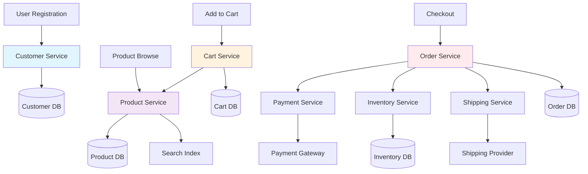

# Chapter 6: Architecture Evolution with AI

Legacy systems often start with clean, simple architectures that gradually become complex monoliths over time. As business requirements evolve and new features are added, the original architectural boundaries blur, dependencies multiply, and what was once a well-structured system becomes a tangled web of interconnected components. AI can help identify these architectural problems and guide the evolution toward more maintainable, scalable, and modern architectures.

## From Monolith to Modular

The journey from monolithic legacy systems to modular architectures is one of the most significant transformations teams undertake. AI can dramatically accelerate this process by analyzing code structure, identifying natural domain boundaries, and suggesting decomposition strategies that would take human architects weeks or months to develop.

### AI-Driven Domain Boundary Identification

One of the most challenging aspects of breaking apart a monolith is determining where to draw the boundaries between different domains or services. AI can analyze codebases to identify cohesive groups of functionality that belong together and loose coupling points that suggest natural boundaries.

#### Analyzing Code Cohesion and Coupling

AI can perform sophisticated analysis of code relationships to identify potential service boundaries:

**Code Analysis for Domain Boundaries**:
```
AI Prompt: "Analyze this e-commerce codebase and identify potential domain boundaries for service decomposition. Consider data access patterns, business logic groupings, and coupling between different functional areas."

AI Analysis Output:

Domain Boundary Analysis for E-commerce System:

1. Customer Management Domain
   - High cohesion: CustomerService, CustomerRepository, CustomerValidator
   - Strong internal coupling: Customer authentication, profile management, preferences
   - Weak external coupling: Only customer ID passed to other domains
   - Data ownership: customers, customer_addresses, customer_preferences tables
   - Boundary strength: STRONG (95% confidence)

2. Product Catalog Domain  
   - High cohesion: ProductService, CategoryService, InventoryService
   - Strong internal coupling: Product search, categorization, pricing
   - Medium external coupling: Product IDs used by Order and Cart domains
   - Data ownership: products, categories, inventory, pricing tables
   - Boundary strength: STRONG (90% confidence)

3. Order Processing Domain
   - Medium cohesion: OrderService, PaymentService, ShippingService
   - High internal coupling: Order workflow, payment processing, fulfillment
   - High external coupling: Depends on Customer, Product, and Inventory domains
   - Data ownership: orders, order_items, payments, shipments tables
   - Boundary strength: MEDIUM (75% confidence)
   - Recommendation: Consider further decomposition

4. Shopping Cart Domain
   - High cohesion: CartService, CartRepository, CartValidator
   - Low external coupling: Communicates via events with Order domain
   - Data ownership: shopping_carts, cart_items tables
   - Boundary strength: STRONG (92% confidence)

5. Notification Domain
   - Medium cohesion: EmailService, SMSService, NotificationService
   - Low coupling: Triggered by events from other domains
   - Data ownership: notifications, notification_templates tables
   - Boundary strength: STRONG (88% confidence)

Problematic Cross-Domain Dependencies:
- OrderService directly queries customer_preferences (should use Customer API)
- ProductService updates inventory directly (should be separate service)
- PaymentService accesses customer payment methods directly (boundary violation)

Recommended Decomposition Order:
1. Extract Notification Service (lowest risk, clear boundaries)
2. Extract Shopping Cart Service (well-defined, low coupling)
3. Extract Customer Management Service (clear domain, some refactoring needed)
4. Extract Product Catalog Service (medium complexity)
5. Decompose Order Processing (highest complexity, consider sub-services)
```

#### Business Capability Mapping

AI can analyze business requirements and map them to technical implementations to identify service boundaries that align with business capabilities:

**Business Capability Analysis**:
```java
// AI-identified business capabilities from code analysis

// Customer Management Capability
public class CustomerManagementService {
    // Capabilities identified by AI:
    // - Customer registration and authentication
    // - Profile management and preferences  
    // - Customer support and account management
    // - Loyalty program management
    
    // Bounded context: Customer identity and lifecycle
    // Data: Customer personal data, preferences, authentication
    // Events published: CustomerRegistered, CustomerUpdated, CustomerDeactivated
    // Events consumed: OrderCompleted (for loyalty points)
}

// Product Catalog Capability  
public class ProductCatalogService {
    // Capabilities identified by AI:
    // - Product information management
    // - Category and taxonomy management
    // - Pricing and promotion management
    // - Product search and discovery
    
    // Bounded context: Product information and organization
    // Data: Product details, categories, pricing, search indexes
    // Events published: ProductCreated, ProductUpdated, PriceChanged
    // Events consumed: InventoryUpdated (for availability)
}

// Order Management Capability
public class OrderManagementService {
    // Capabilities identified by AI:
    // - Order creation and modification
    // - Order workflow and status tracking
    // - Order history and reporting
    // - Return and refund processing
    
    // Bounded context: Order lifecycle management
    // Data: Orders, order items, order status, order history
    // Events published: OrderCreated, OrderShipped, OrderCancelled
    // Events consumed: PaymentProcessed, InventoryReserved
}
```

#### Data Flow Analysis

AI can trace how data flows through the system to identify natural boundaries and potential areas of tight coupling:

**Data Flow Mapping Example**:


**AI Data Flow Analysis**:
```
Data Flow Analysis Results:

High-Frequency Data Paths:
1. Customer ID: Used in 23 different services (over-shared)
2. Product ID: Referenced in 15 services (acceptable sharing)
3. Order data: Accessed by 8 services (some boundary violations)

Data Hotspots (potential service boundaries):
- Customer data: Centralized in CustomerService (good boundary)
- Product data: Distributed across 6 services (needs consolidation)
- Inventory data: Updated by 4 different services (coordination needed)

Boundary Violations Detected:
- OrderService directly updates customer loyalty points
- ProductService directly decrements inventory
- PaymentService reads customer billing preferences directly

Recommended Data Ownership:
- Customer Service: All customer personal data, preferences, authentication
- Product Service: Product information, categories, basic inventory counts
- Inventory Service: Detailed inventory tracking, reservations, fulfillment
- Order Service: Order data, order workflow, order history
- Payment Service: Payment transactions, payment methods (encrypted)
```

### Service Decomposition Strategies

Once domain boundaries are identified, AI can help plan the decomposition strategy, including the order of extraction, risk assessment, and migration approaches.

#### Extraction Prioritization

AI can assess the risk and benefit of extracting different services to recommend an optimal sequence:

**Service Extraction Priority Matrix**:
```
AI-Generated Extraction Plan:

Priority 1 (High Benefit, Low Risk):
Service: Notification Service
- Benefits: Clear boundaries, no business logic dependencies
- Risks: Low - only sends notifications, easily reversible
- Effort: 2-3 weeks
- Dependencies: None (event-driven)
- Rollback plan: Route events back to monolith

Service: File Upload Service  
- Benefits: Resource isolation, scalability improvements
- Risks: Low - stateless operations, clear interface
- Effort: 1-2 weeks
- Dependencies: Storage configuration
- Rollback plan: Proxy requests back to monolith

Priority 2 (High Benefit, Medium Risk):
Service: User Authentication Service
- Benefits: Security isolation, reusability across applications
- Risks: Medium - critical path, session management complexity
- Effort: 4-6 weeks
- Dependencies: Session store, identity provider integration
- Rollback plan: Dual authentication during transition

Service: Product Catalog Service
- Benefits: Clear domain boundary, enables catalog team autonomy
- Risks: Medium - search functionality complexity, data migration
- Effort: 6-8 weeks
- Dependencies: Search infrastructure, image storage
- Rollback plan: Database synchronization during transition

Priority 3 (High Benefit, High Risk):
Service: Order Processing Service
- Benefits: Critical business logic isolation, scalability
- Risks: High - complex workflows, transaction management
- Effort: 10-12 weeks  
- Dependencies: Payment service, inventory service, messaging
- Rollback plan: Parallel processing with reconciliation

Service: Payment Processing Service
- Benefits: PCI compliance isolation, security improvements
- Risks: High - financial transactions, complex error handling
- Effort: 8-10 weeks
- Dependencies: Payment gateways, fraud detection, encryption
- Rollback plan: Circuit breaker with monolith fallback
```

#### Strangler Fig Implementation for Services

The Strangler Fig pattern can be applied at the service level to gradually replace monolithic functionality:

**AI-Guided Strangler Fig for Service Extraction**:
```java
// AI-suggested proxy pattern for gradual service extraction
@RestController
@RequestMapping("/api/customers")
public class CustomerServiceProxy {
    
    private MonolithCustomerService monolithService;
    private NewCustomerService newCustomerService;
    private FeatureToggleService featureToggle;
    private CustomerMigrationTracker migrationTracker;
    
    @GetMapping("/{customerId}")
    public ResponseEntity<Customer> getCustomer(@PathVariable String customerId) {
        // AI-determined routing logic
        if (shouldUseNewService(customerId)) {
            try {
                Customer customer = newCustomerService.getCustomer(customerId);
                migrationTracker.recordSuccess(customerId, "READ");
                return ResponseEntity.ok(customer);
            } catch (Exception e) {
                // Fallback to monolith on any error
                migrationTracker.recordFallback(customerId, "READ", e);
                return getCustomerFromMonolith(customerId);
            }
        } else {
            return getCustomerFromMonolith(customerId);
        }
    }
    
    @PostMapping
    public ResponseEntity<Customer> createCustomer(@RequestBody CreateCustomerRequest request) {
        if (featureToggle.isEnabled("new-customer-service-writes")) {
            try {
                // Dual write: create in both systems for safety
                Customer customer = newCustomerService.createCustomer(request);
                monolithService.createCustomer(request); // Async backup
                
                migrationTracker.recordSuccess(customer.getId(), "CREATE");
                return ResponseEntity.ok(customer);
            } catch (Exception e) {
                // Fallback to monolith creation
                migrationTracker.recordFallback(null, "CREATE", e);
                return createCustomerInMonolith(request);
            }
        } else {
            return createCustomerInMonolith(request);
        }
    }
    
    private boolean shouldUseNewService(String customerId) {
        // AI-suggested gradual rollout strategy
        if (!featureToggle.isEnabled("new-customer-service")) {
            return false;
        }
        
        // Route based on customer ID hash for consistent experience
        int hash = Math.abs(customerId.hashCode());
        int rolloutPercentage = featureToggle.getRolloutPercentage("new-customer-service");
        return (hash % 100) < rolloutPercentage;
    }
}

// AI-suggested monitoring and validation
@Component
public class ServiceMigrationValidator {
    
    @Scheduled(fixedRate = 300000) // Every 5 minutes
    public void validateDataConsistency() {
        List<String> recentCustomers = migrationTracker.getRecentlyMigratedCustomers();
        
        for (String customerId : recentCustomers) {
            Customer monolithCustomer = monolithService.getCustomer(customerId);
            Customer newServiceCustomer = newCustomerService.getCustomer(customerId);
            
            if (!customersAreEquivalent(monolithCustomer, newServiceCustomer)) {
                alertingService.sendDataInconsistencyAlert(customerId);
                // Automatically trigger data reconciliation
                dataReconciliationService.reconcileCustomer(customerId);
            }
        }
    }
}
```

#### Event-Driven Architecture Planning

AI can help design event-driven communication patterns between services:

**AI-Designed Event Architecture**:
```java
// AI-suggested event schema and flow
public class CustomerEvents {
    
    @Event
    public class CustomerRegistered {
        private String customerId;
        private String email;
        private Instant registrationTime;
        private CustomerTier initialTier;
        private Map<String, Object> metadata;
        
        // AI determines what data other services need
        // Avoids over-sharing sensitive information
    }
    
    @Event
    public class CustomerTierUpgraded {
        private String customerId;
        private CustomerTier previousTier;
        private CustomerTier newTier;
        private Instant upgradeTime;
        private String reason; // Purchase amount, manual upgrade, etc.
    }
    
    @Event
    public class CustomerDeactivated {
        private String customerId;
        private Instant deactivationTime;
        private String reason;
        private boolean allowReactivation;
    }
}

// AI-suggested event handlers
@EventHandler
public class OrderServiceEventHandler {
    
    @HandleEvent
    public void handleCustomerTierUpgraded(CustomerTierUpgraded event) {
        // Update pricing calculations for pending orders
        orderService.recalculatePendingOrderPricing(event.getCustomerId());
        
        // Send congratulatory email with tier benefits
        notificationService.sendTierUpgradeNotification(event);
    }
    
    @HandleEvent
    public void handleCustomerDeactivated(CustomerDeactivated event) {
        if (!event.isAllowReactivation()) {
            // Cancel all pending orders for permanently deactivated customers
            orderService.cancelPendingOrders(event.getCustomerId(), "Customer deactivated");
        }
    }
}

// AI-suggested event sourcing for complex business logic
@EventSourcingAggregate
public class Order {
    private String orderId;
    private String customerId;
    private OrderStatus status;
    private List<OrderItem> items;
    private PaymentInfo paymentInfo;
    
    // AI identifies state changes that should be events
    public void placeOrder(PlaceOrderCommand command) {
        // Validate command
        validateOrderCommand(command);
        
        // Apply event
        apply(new OrderPlaced(
            command.getOrderId(),
            command.getCustomerId(),
            command.getItems(),
            Instant.now()
        ));
    }
    
    public void confirmPayment(PaymentConfirmation confirmation) {
        if (this.status != OrderStatus.PENDING_PAYMENT) {
            throw new IllegalStateException("Cannot confirm payment for order in status: " + this.status);
        }
        
        apply(new PaymentConfirmed(
            this.orderId,
            confirmation.getPaymentId(),
            confirmation.getAmount(),
            Instant.now()
        ));
    }
}
```

### API Design and Evolution

As services are extracted from monoliths, well-designed APIs become critical for communication between components. AI can help design APIs that are consistent, evolvable, and performant.

#### RESTful API Design Principles

AI can analyze existing interfaces and suggest improvements based on REST principles and modern API design best practices:

**AI-Improved API Design**:
```java
// Legacy API (problematic design)
@RestController
public class CustomerController {
    
    @GetMapping("/getCustomer")
    public String getCustomer(@RequestParam String id) {
        // Problems: Non-RESTful URL, string return type, no error handling
        return customerService.findById(id).toString();
    }
    
    @PostMapping("/updateCustomer")
    public String updateCustomer(@RequestParam String data) {
        // Problems: POST for update, unstructured input, no validation
        Customer customer = parseCustomerFromString(data);
        customerService.update(customer);
        return "success";
    }
}

// AI-suggested modern API design
@RestController
@RequestMapping("/api/v1/customers")
@Validated
public class CustomerApiController {
    
    private CustomerService customerService;
    private CustomerMapper customerMapper;
    
    @GetMapping("/{customerId}")
    @Operation(summary = "Get customer by ID", description = "Retrieves a customer's information by their unique identifier")
    @ApiResponses({
        @ApiResponse(responseCode = "200", description = "Customer found"),
        @ApiResponse(responseCode = "404", description = "Customer not found"),
        @ApiResponse(responseCode = "400", description = "Invalid customer ID format")
    })
    public ResponseEntity<ApiResponse<CustomerDto>> getCustomer(
            @PathVariable 
            @Parameter(description = "Customer unique identifier", example = "123e4567-e89b-12d3-a456-426614174000")
            @Valid @UUID String customerId,
            @RequestHeader(value = "Accept-Language", defaultValue = "en") String language) {
        
        try {
            Customer customer = customerService.findById(customerId);
            if (customer == null) {
                return ResponseEntity.notFound().build();
            }
            
            CustomerDto dto = customerMapper.toDto(customer, language);
            ApiResponse<CustomerDto> response = ApiResponse.success(dto);
            
            return ResponseEntity.ok()
                .cacheControl(CacheControl.maxAge(Duration.ofMinutes(5)))
                .eTag(customer.getVersion().toString())
                .body(response);
                
        } catch (IllegalArgumentException e) {
            ApiResponse<CustomerDto> errorResponse = ApiResponse.validationError(
                "INVALID_CUSTOMER_ID", 
                "Customer ID must be a valid UUID"
            );
            return ResponseEntity.badRequest().body(errorResponse);
        }
    }
    
    @PutMapping("/{customerId}")
    @Operation(summary = "Update customer", description = "Updates an existing customer's information")
    public ResponseEntity<ApiResponse<CustomerDto>> updateCustomer(
            @PathVariable @Valid @UUID String customerId,
            @RequestBody @Valid UpdateCustomerRequest request,
            @RequestHeader(value = "If-Match", required = false) String ifMatch) {
        
        try {
            // Optimistic locking support
            if (ifMatch != null) {
                customerService.validateVersion(customerId, ifMatch);
            }
            
            Customer updatedCustomer = customerService.update(customerId, request);
            CustomerDto dto = customerMapper.toDto(updatedCustomer);
            
            return ResponseEntity.ok()
                .eTag(updatedCustomer.getVersion().toString())
                .body(ApiResponse.success(dto));
                
        } catch (CustomerNotFoundException e) {
            return ResponseEntity.notFound().build();
        } catch (OptimisticLockException e) {
            ApiResponse<CustomerDto> errorResponse = ApiResponse.error(
                "OPTIMISTIC_LOCK_ERROR",
                "Customer was modified by another user. Please refresh and try again."
            );
            return ResponseEntity.status(HttpStatus.CONFLICT).body(errorResponse);
        } catch (ValidationException e) {
            ApiResponse<CustomerDto> errorResponse = ApiResponse.validationError(e.getErrors());
            return ResponseEntity.badRequest().body(errorResponse);
        }
    }
    
    @GetMapping
    @Operation(summary = "Search customers", description = "Searches customers with pagination and filtering")
    public ResponseEntity<PagedApiResponse<CustomerDto>> searchCustomers(
            @RequestParam(defaultValue = "0") @Min(0) int page,
            @RequestParam(defaultValue = "20") @Min(1) @Max(100) int size,
            @RequestParam(required = false) String email,
            @RequestParam(required = false) CustomerStatus status,
            @RequestParam(defaultValue = "createdAt") String sortBy,
            @RequestParam(defaultValue = "desc") String sortDirection) {
        
        CustomerSearchCriteria criteria = CustomerSearchCriteria.builder()
            .email(email)
            .status(status)
            .build();
            
        Sort sort = Sort.by(Sort.Direction.fromString(sortDirection), sortBy);
        Pageable pageable = PageRequest.of(page, size, sort);
        
        Page<Customer> customers = customerService.search(criteria, pageable);
        Page<CustomerDto> customerDtos = customers.map(customerMapper::toDto);
        
        PagedApiResponse<CustomerDto> response = PagedApiResponse.of(customerDtos);
        
        return ResponseEntity.ok()
            .cacheControl(CacheControl.maxAge(Duration.ofMinutes(1)))
            .body(response);
    }
}

// AI-suggested API response wrapper for consistency
public class ApiResponse<T> {
    private boolean success;
    private T data;
    private List<ApiError> errors;
    private Map<String, Object> metadata;
    private Instant timestamp;
    
    public static <T> ApiResponse<T> success(T data) {
        return ApiResponse.<T>builder()
            .success(true)
            .data(data)
            .timestamp(Instant.now())
            .build();
    }
    
    public static <T> ApiResponse<T> error(String code, String message) {
        return ApiResponse.<T>builder()
            .success(false)
            .errors(List.of(new ApiError(code, message)))
            .timestamp(Instant.now())
            .build();
    }
}
```

#### API Versioning Strategies

AI can help plan API evolution strategies that maintain backward compatibility while allowing for innovation:

**AI-Suggested Versioning Strategy**:
```java
// URL-based versioning with backward compatibility
@RestController
@RequestMapping("/api")
public class VersionedCustomerController {
    
    private CustomerServiceV1 customerServiceV1;
    private CustomerServiceV2 customerServiceV2;
    private ApiVersionResolver versionResolver;
    
    @GetMapping({"/v1/customers/{id}", "/v2/customers/{id}"})
    public ResponseEntity<?> getCustomer(
            @PathVariable String id,
            HttpServletRequest request) {
        
        ApiVersion version = versionResolver.resolveVersion(request);
        
        switch (version) {
            case V1:
                CustomerV1Dto customerV1 = customerServiceV1.getCustomer(id);
                return ResponseEntity.ok(customerV1);
                
            case V2:
                CustomerV2Dto customerV2 = customerServiceV2.getCustomer(id);
                return ResponseEntity.ok(ApiResponse.success(customerV2));
                
            default:
                return ResponseEntity.badRequest()
                    .body(ApiResponse.error("UNSUPPORTED_VERSION", "API version not supported"));
        }
    }
}

// AI-suggested header-based versioning for gradual migration
@RestController
@RequestMapping("/api/customers")
public class HeaderVersionedController {
    
    @GetMapping("/{id}")
    public ResponseEntity<?> getCustomer(
            @PathVariable String id,
            @RequestHeader(value = "API-Version", defaultValue = "1.0") String apiVersion,
            @RequestHeader(value = "Accept", defaultValue = "application/json") String acceptHeader) {
        
        // Support for content negotiation
        if (acceptHeader.contains("application/vnd.company.customer.v2+json")) {
            return getCustomerV2(id);
        } else if (apiVersion.startsWith("2.")) {
            return getCustomerV2(id);
        } else {
            return getCustomerV1(id);
        }
    }
    
    private ResponseEntity<CustomerV2Dto> getCustomerV2(String id) {
        // Modern API implementation with full error handling
        CustomerV2Dto customer = customerServiceV2.getCustomer(id);
        return ResponseEntity.ok()
            .header("API-Version", "2.0")
            .header("Content-Type", "application/vnd.company.customer.v2+json")
            .body(customer);
    }
    
    private ResponseEntity<CustomerV1Dto> getCustomerV1(String id) {
        // Legacy API implementation for backward compatibility
        CustomerV1Dto customer = customerServiceV1.getCustomer(id);
        return ResponseEntity.ok()
            .header("API-Version", "1.0")
            .header("Deprecation", "true")
            .header("Sunset", "2024-12-31")
            .body(customer);
    }
}

// AI-suggested deprecation strategy
@Component
public class ApiDeprecationManager {
    
    private ApiMetricsService metricsService;
    private NotificationService notificationService;
    
    @EventListener
    public void handleApiRequest(ApiRequestEvent event) {
        if (isDeprecatedVersion(event.getVersion())) {
            // Track usage of deprecated APIs
            metricsService.recordDeprecatedApiUsage(
                event.getEndpoint(), 
                event.getVersion(), 
                event.getClientId()
            );
            
            // Notify API consumers about deprecation
            if (shouldNotifyClient(event.getClientId(), event.getVersion())) {
                notificationService.sendDeprecationWarning(
                    event.getClientId(),
                    event.getVersion(),
                    getDeprecationTimeline(event.getVersion())
                );
            }
        }
    }
    
    @Scheduled(cron = "0 0 9 * * MON") // Every Monday at 9 AM
    public void generateDeprecationReport() {
        List<ApiUsageReport> reports = metricsService.getDeprecatedApiUsage();
        
        for (ApiUsageReport report : reports) {
            if (report.getUsageCount() > 0) {
                notificationService.sendWeeklyDeprecationReport(
                    report.getClientId(),
                    report
                );
            }
        }
    }
}
```

## Technology Stack Assessment

Legacy systems often use outdated technology stacks that make development slower, security riskier, and maintenance more expensive. AI can help assess current technology choices and plan migration paths to modern alternatives.

### Framework Migration Planning

AI can analyze existing framework usage and suggest migration strategies that minimize risk while maximizing benefits.

#### Framework Compatibility Analysis

AI can assess the effort required to migrate between different frameworks:

**Framework Migration Analysis Example**:
```
AI Framework Migration Assessment:

Current Stack: Spring Boot 1.5.x, Java 8, MySQL 5.7
Target Stack: Spring Boot 3.x, Java 17, PostgreSQL 14

Migration Complexity Analysis:

CRITICAL (Breaking Changes):
- Spring Security configuration format changed significantly
- Javax → Jakarta namespace migration required
- Spring Data repository query methods have new syntax
- WebMvcConfigurer interface changes

HIGH (Significant Effort):
- Spring Boot configuration properties renamed/restructured
- Actuator endpoints moved and secured differently  
- Testing framework changes (JUnit 4 → JUnit 5)
- Servlet API changes (3.1 → 5.0)

MEDIUM (Moderate Effort):
- New Spring Boot starter dependencies
- Configuration property validation changes
- Logging configuration updates
- Database driver updates for PostgreSQL

LOW (Minor Changes):
- Import statement updates for Jakarta
- Minor API method signature changes
- Updated Maven/Gradle plugin versions

Estimated Migration Effort:
- Development time: 6-8 weeks
- Testing time: 3-4 weeks  
- Documentation updates: 1 week
- Team training: 2 weeks

Risk Mitigation Strategy:
1. Create feature branch for migration
2. Implement dual-stack testing (old vs new)
3. Gradual rollout with canary deployments
4. Maintain rollback capability for 30 days

Recommended Migration Path:
Phase 1: Java 8 → Java 11 (lower risk, valuable improvements)
Phase 2: Spring Boot 1.5 → Spring Boot 2.7 (intermediate step)
Phase 3: Javax → Jakarta migration
Phase 4: Spring Boot 2.7 → Spring Boot 3.x
Phase 5: Java 11 → Java 17
Phase 6: MySQL → PostgreSQL (if desired)
```

#### Automated Code Migration

AI can help automate parts of the migration process by generating updated code:

**AI-Assisted Migration Scripts**:
```java
// Original Spring Boot 1.x configuration
@Configuration
@EnableWebSecurity
public class SecurityConfig extends WebSecurityConfigurerAdapter {
    
    @Override
    protected void configure(HttpSecurity http) throws Exception {
        http
            .authorizeRequests()
                .antMatchers("/public/**").permitAll()
                .antMatchers("/admin/**").hasRole("ADMIN")
                .anyRequest().authenticated()
            .and()
            .formLogin()
                .loginPage("/login")
                .permitAll()
            .and()
            .logout()
                .permitAll();
    }
    
    @Override
    protected void configure(AuthenticationManagerBuilder auth) throws Exception {
        auth
            .userDetailsService(userDetailsService)
            .passwordEncoder(passwordEncoder());
    }
}

// AI-generated Spring Boot 3.x configuration
@Configuration
@EnableWebSecurity
public class SecurityConfig {
    
    private final UserDetailsService userDetailsService;
    private final PasswordEncoder passwordEncoder;
    
    public SecurityConfig(UserDetailsService userDetailsService, PasswordEncoder passwordEncoder) {
        this.userDetailsService = userDetailsService;
        this.passwordEncoder = passwordEncoder;
    }
    
    @Bean
    public SecurityFilterChain filterChain(HttpSecurity http) throws Exception {
        http
            .authorizeHttpRequests(authz -> authz
                .requestMatchers("/public/**").permitAll()
                .requestMatchers("/admin/**").hasRole("ADMIN")
                .anyRequest().authenticated()
            )
            .formLogin(form -> form
                .loginPage("/login")
                .permitAll()
            )
            .logout(logout -> logout
                .permitAll()
            );
        
        return http.build();
    }
    
    @Bean
    public AuthenticationManager authenticationManager() {
        DaoAuthenticationProvider provider = new DaoAuthenticationProvider();
        provider.setUserDetailsService(userDetailsService);
        provider.setPasswordEncoder(passwordEncoder);
        
        return new ProviderManager(provider);
    }
}

// AI-generated migration utility
public class SpringBootMigrationHelper {
    
    public void migrateSecurityConfiguration(String sourceFile, String targetFile) {
        // AI-powered code transformation
        String sourceCode = readFile(sourceFile);
        
        // Replace deprecated patterns
        String migratedCode = sourceCode
            .replaceAll("extends WebSecurityConfigurerAdapter", "")
            .replaceAll("@Override\\s+protected void configure\\(HttpSecurity http\\)", 
                       "@Bean\\n    public SecurityFilterChain filterChain(HttpSecurity http)")
            .replaceAll("\\.authorizeRequests\\(\\)", 
                       ".authorizeHttpRequests(authz -> authz")
            .replaceAll("\\.antMatchers\\(", 
                       ".requestMatchers(")
            .replaceAll("\\.and\\(\\)", ")")
            .replaceAll("http\\.build\\(\\);", "return http.build();");
        
        writeFile(targetFile, migratedCode);
    }
    
    public void migrateJavaxToJakarta(String projectPath) {
        // Replace all javax imports with jakarta equivalents
        Map<String, String> replacements = Map.of(
            "javax.servlet", "jakarta.servlet",
            "javax.persistence", "jakarta.persistence",
            "javax.validation", "jakarta.validation",
            "javax.annotation", "jakarta.annotation"
        );
        
        Files.walk(Paths.get(projectPath))
            .filter(path -> path.toString().endsWith(".java"))
            .forEach(path -> {
                try {
                    String content = Files.readString(path);
                    String updatedContent = content;
                    
                    for (Map.Entry<String, String> replacement : replacements.entrySet()) {
                        updatedContent = updatedContent.replace(replacement.getKey(), replacement.getValue());
                    }
                    
                    if (!content.equals(updatedContent)) {
                        Files.writeString(path, updatedContent);
                        System.out.println("Updated: " + path);
                    }
                } catch (IOException e) {
                    System.err.println("Failed to update: " + path + " - " + e.getMessage());
                }
            });
    }
}
```

### Language and Platform Modernization

Legacy systems may be written in older versions of programming languages or run on outdated platforms. AI can help assess the benefits and risks of language modernization.

#### Language Version Upgrade Analysis

AI can analyze codebases to identify which modern language features would provide the most benefit:

**Java Version Upgrade Analysis**:
```
AI Language Modernization Assessment:

Current: Java 8
Target: Java 17 (LTS)

Feature Adoption Opportunities:

HIGH IMPACT:
1. Records (Java 14+)
   - Found 47 data classes that could become records
   - Reduces boilerplate by ~60% for DTOs
   - Example: Customer, Order, Product data classes
   
2. Switch Expressions (Java 14+)
   - Found 23 traditional switch statements that could be modernized
   - Improves readability and reduces bugs
   - Example: Status mapping, type conversions
   
3. Text Blocks (Java 15+)
   - Found 15 multi-line string concatenations
   - Improves SQL query and JSON template readability
   - Reduces string escaping errors

4. Pattern Matching for instanceof (Java 16+)
   - Found 31 instanceof checks with manual casting
   - Reduces code verbosity and potential ClassCastExceptions

MEDIUM IMPACT:
1. var keyword (Java 10+)
   - Could reduce verbosity in 156 variable declarations
   - Improves readability for complex generic types
   
2. Optional improvements (Java 9-11)
   - or(), ifPresentOrElse(), stream() methods available
   - Found 23 places where new Optional methods could simplify code

3. Collection factory methods (Java 9+)
   - List.of(), Set.of(), Map.of() instead of builders
   - Found 67 collection initializations that could be simplified

LOW IMPACT:
1. HTTP Client (Java 11+)
   - Could replace Apache HttpClient in 5 locations
   - Native solution, but migration effort may not be worth it

2. Sealed Classes (Java 17+)
   - Found 3 enum-like inheritance hierarchies
   - Could improve type safety but requires design changes

Migration Code Examples:

// Before (Java 8)
public class Customer {
    private final String id;
    private final String name;
    private final String email;
    
    public Customer(String id, String name, String email) {
        this.id = id;
        this.name = name;
        this.email = email;
    }
    
    public String getId() { return id; }
    public String getName() { return name; }
    public String getEmail() { return email; }
    
    @Override
    public boolean equals(Object o) {
        if (this == o) return true;
        if (o == null || getClass() != o.getClass()) return false;
        Customer customer = (Customer) o;
        return Objects.equals(id, customer.id) &&
               Objects.equals(name, customer.name) &&
               Objects.equals(email, customer.email);
    }
    
    @Override
    public int hashCode() {
        return Objects.hash(id, name, email);
    }
}

// After (Java 17 with Records)
public record Customer(String id, String name, String email) {
    public Customer {
        // Validation can be added in compact constructor
        Objects.requireNonNull(id, "ID cannot be null");
        Objects.requireNonNull(name, "Name cannot be null");
        Objects.requireNonNull(email, "Email cannot be null");
    }
}

// Before (Java 8 - Switch statement)
public String getStatusMessage(OrderStatus status) {
    switch (status) {
        case PENDING:
            return "Order is pending";
        case PROCESSING:
            return "Order is being processed";
        case SHIPPED:
            return "Order has been shipped";
        case DELIVERED:
            return "Order has been delivered";
        case CANCELLED:
            return "Order was cancelled";
        default:
            return "Unknown status";
    }
}

// After (Java 17 - Switch expression)
public String getStatusMessage(OrderStatus status) {
    return switch (status) {
        case PENDING -> "Order is pending";
        case PROCESSING -> "Order is being processed";
        case SHIPPED -> "Order has been shipped";
        case DELIVERED -> "Order has been delivered";
        case CANCELLED -> "Order was cancelled";
    };
}

// Before (Java 8 - Text concatenation)
public String buildQuery(String customerId, String productId) {
    return "SELECT o.id, o.total, o.created_date " +
           "FROM orders o " +
           "JOIN order_items oi ON o.id = oi.order_id " +
           "WHERE o.customer_id = '" + customerId + "' " +
           "AND oi.product_id = '" + productId + "' " +
           "ORDER BY o.created_date DESC";
}

// After (Java 17 - Text blocks)
public String buildQuery(String customerId, String productId) {
    return """
        SELECT o.id, o.total, o.created_date
        FROM orders o
        JOIN order_items oi ON o.id = oi.order_id
        WHERE o.customer_id = '%s'
        AND oi.product_id = '%s'
        ORDER BY o.created_date DESC
        """.formatted(customerId, productId);
}

Estimated Benefits:
- Code reduction: ~15-20%
- Improved readability: High
- Reduced bugs: Medium (fewer manual implementations)
- Developer productivity: +25%
- Maintenance effort: -30%

Migration Risks:
- Learning curve: 2-3 weeks for team
- Testing effort: High (need to verify behavior unchanged)
- Tooling compatibility: Check IDE, build tools, static analysis
```

#### Platform Migration Assessment

AI can evaluate the benefits and challenges of migrating to different platforms:

**Platform Migration Analysis**:
```
Platform Migration Assessment:

Current: Traditional JVM deployment on VMs
Target Options: Container-based deployment

Option 1: Docker + Kubernetes
Benefits:
- Resource efficiency: ~40% cost reduction
- Deployment consistency: Eliminates "works on my machine"
- Scalability: Auto-scaling based on demand
- Development productivity: Local development mirrors production

Challenges:
- Container learning curve: 3-4 weeks for team
- Kubernetes complexity: Requires DevOps expertise
- Monitoring changes: Need container-aware monitoring
- Persistent data handling: Database deployment strategy

Migration Effort: 8-12 weeks

Option 2: Serverless (AWS Lambda, Azure Functions)
Benefits:
- No infrastructure management
- Pay-per-execution pricing
- Automatic scaling to zero
- Built-in high availability

Challenges:
- Cold start latency: 100-500ms delay
- Execution time limits: 15 minutes max
- Stateless requirement: Significant architecture changes
- Vendor lock-in: Platform-specific APIs

Migration Effort: 16-20 weeks (requires major refactoring)

Option 3: Cloud-Native PaaS (Heroku, Cloud Foundry)
Benefits:
- Minimal infrastructure complexity
- Fast deployment and scaling
- Built-in monitoring and logging
- Database and service integrations

Challenges:
- Higher per-unit cost than containers
- Less configuration flexibility
- Potential vendor lock-in
- Limited customization options

Migration Effort: 4-6 weeks

Recommendation: Docker + Kubernetes
- Best balance of benefits vs. complexity
- Industry standard with broad ecosystem
- Preserves application architecture
- Skills transferable across cloud providers
```

### Performance Impact Analysis

When modernizing technology stacks, it's crucial to understand the performance implications. AI can help predict and measure performance changes.

#### Benchmarking and Performance Prediction

AI can analyze application patterns and predict performance impacts of technology changes:

**Performance Impact Analysis Example**:
```java
// AI-generated performance comparison framework
@Component
public class PerformanceMigrationAnalyzer {
    
    private MicrometerRegistry meterRegistry;
    private PerformanceTestExecutor testExecutor;
    
    public MigrationPerformanceReport analyzeFrameworkMigration(
            String legacyVersion, String targetVersion) {
        
        // AI-suggested performance test scenarios
        List<PerformanceTestScenario> scenarios = List.of(
            new PerformanceTestScenario("startup-time", this::measureStartupTime),
            new PerformanceTestScenario("memory-usage", this::measureMemoryUsage),
            new PerformanceTestScenario("request-throughput", this::measureRequestThroughput),
            new PerformanceTestScenario("database-performance", this::measureDatabasePerformance),
            new PerformanceTestScenario("gc-performance", this::measureGarbageCollection)
        );
        
        MigrationPerformanceReport report = new MigrationPerformanceReport();
        
        for (PerformanceTestScenario scenario : scenarios) {
            PerformanceMetrics legacyMetrics = testExecutor.execute(scenario, legacyVersion);
            PerformanceMetrics targetMetrics = testExecutor.execute(scenario, targetVersion);
            
            PerformanceComparison comparison = new PerformanceComparison(
                scenario.getName(),
                legacyMetrics,
                targetMetrics,
                calculateImprovement(legacyMetrics, targetMetrics)
            );
            
            report.addComparison(comparison);
        }
        
        return report;
    }
    
    private PerformanceMetrics measureStartupTime() {
        Timer.Sample sample = Timer.start(meterRegistry);
        
        // Simulate application startup
        long startTime = System.currentTimeMillis();
        // ... startup simulation logic
        long endTime = System.currentTimeMillis();
        
        sample.stop(Timer.builder("app.startup.time").register(meterRegistry));
        
        return PerformanceMetrics.builder()
            .startupTimeMs(endTime - startTime)
            .build();
    }
    
    private PerformanceMetrics measureMemoryUsage() {
        System.gc(); // Force garbage collection for accurate measurement
        
        MemoryMXBean memoryBean = ManagementFactory.getMemoryMXBean();
        MemoryUsage heapUsage = memoryBean.getHeapMemoryUsage();
        MemoryUsage nonHeapUsage = memoryBean.getNonHeapMemoryUsage();
        
        return PerformanceMetrics.builder()
            .heapMemoryUsedMB(heapUsage.getUsed() / 1024 / 1024)
            .heapMemoryMaxMB(heapUsage.getMax() / 1024 / 1024)
            .nonHeapMemoryUsedMB(nonHeapUsage.getUsed() / 1024 / 1024)
            .build();
    }
    
    private PerformanceMetrics measureRequestThroughput() {
        // AI-suggested load testing pattern
        LoadTestConfig config = LoadTestConfig.builder()
            .concurrentUsers(100)
            .durationMinutes(5)
            .rampUpTimeSeconds(30)
            .endpoints(List.of("/api/customers", "/api/orders", "/api/products"))
            .build();
        
        LoadTestResult result = testExecutor.executeLoadTest(config);
        
        return PerformanceMetrics.builder()
            .requestsPerSecond(result.getRequestsPerSecond())
            .averageResponseTimeMs(result.getAverageResponseTime())
            .p95ResponseTimeMs(result.getP95ResponseTime())
            .p99ResponseTimeMs(result.getP99ResponseTime())
            .errorRate(result.getErrorRate())
            .build();
    }
}

// AI-suggested performance regression testing
@Component
public class PerformanceRegressionDetector {
    
    private static final double PERFORMANCE_THRESHOLD = 0.05; // 5% degradation threshold
    
    public void detectPerformanceRegressions(
            PerformanceMetrics baseline, 
            PerformanceMetrics current) {
        
        List<PerformanceRegression> regressions = new ArrayList<>();
        
        // Check startup time regression
        if (hasRegression(baseline.getStartupTimeMs(), current.getStartupTimeMs())) {
            regressions.add(new PerformanceRegression(
                "STARTUP_TIME_REGRESSION",
                baseline.getStartupTimeMs(),
                current.getStartupTimeMs(),
                calculateRegressionPercentage(baseline.getStartupTimeMs(), current.getStartupTimeMs())
            ));
        }
        
        // Check memory usage regression
        if (hasRegression(baseline.getHeapMemoryUsedMB(), current.getHeapMemoryUsedMB())) {
            regressions.add(new PerformanceRegression(
                "MEMORY_USAGE_REGRESSION",
                baseline.getHeapMemoryUsedMB(),
                current.getHeapMemoryUsedMB(),
                calculateRegressionPercentage(baseline.getHeapMemoryUsedMB(), current.getHeapMemoryUsedMB())
            ));
        }
        
        // Check throughput regression (lower is worse)
        if (hasRegression(current.getRequestsPerSecond(), baseline.getRequestsPerSecond())) {
            regressions.add(new PerformanceRegression(
                "THROUGHPUT_REGRESSION",
                baseline.getRequestsPerSecond(),
                current.getRequestsPerSecond(),
                calculateRegressionPercentage(current.getRequestsPerSecond(), baseline.getRequestsPerSecond())
            ));
        }
        
        if (!regressions.isEmpty()) {
            alertingService.sendPerformanceRegressionAlert(regressions);
            throw new PerformanceRegressionException("Performance regressions detected", regressions);
        }
    }
    
    private boolean hasRegression(double baseline, double current) {
        return (current - baseline) / baseline > PERFORMANCE_THRESHOLD;
    }
}
```

## Cloud-Native Transformation

Moving legacy applications to cloud-native architectures represents one of the most significant transformations organizations undertake. AI can help plan and execute this transformation systematically.

### Containerization Strategies

The first step in cloud-native transformation is usually containerization. AI can help analyze applications and suggest optimal containerization approaches.

#### Application Analysis for Containerization

AI can analyze applications to identify containerization opportunities and challenges:

**AI Containerization Assessment**:
```dockerfile
# AI-generated Dockerfile based on application analysis
FROM openjdk:17-jre-slim as base

# AI identified these as required system packages
RUN apt-get update && apt-get install -y \
    curl \
    jq \
    && rm -rf /var/lib/apt/lists/*

# Create non-root user for security
RUN addgroup --system appgroup && adduser --system --group appuser

# AI-suggested volume mounts based on file system analysis
VOLUME ["/app/logs", "/app/config", "/app/uploads"]

# Multi-stage build for optimization
FROM base as dependencies
COPY pom.xml .
COPY src/main/resources/application.yml ./src/main/resources/
RUN mvn dependency:go-offline -B

FROM dependencies as build
COPY src ./src
RUN mvn clean package -DskipTests

FROM base as runtime

# AI identified these environment variables from code analysis
ENV JAVA_OPTS="-XX:+UseG1GC -XX:MaxRAMPercentage=75" \
    DATABASE_URL="" \
    REDIS_URL="" \
    LOG_LEVEL="INFO" \
    PROFILE="production"

# Copy application
COPY --from=build target/app.jar app.jar
COPY docker-entrypoint.sh .
RUN chmod +x docker-entrypoint.sh

# Switch to non-root user
USER appuser

# AI-suggested health check based on existing endpoints
HEALTHCHECK --interval=30s --timeout=3s --start-period=60s --retries=3 \
    CMD curl -f http://localhost:8080/actuator/health || exit 1

EXPOSE 8080

ENTRYPOINT ["./docker-entrypoint.sh"]
CMD ["java", "-jar", "app.jar"]

# AI-generated entrypoint script
#!/bin/bash
set -e

# Wait for dependencies (AI identified database dependency)
until curl -f "${DATABASE_URL}/health" > /dev/null 2>&1; do
    echo "Waiting for database..."
    sleep 2
done

# Start application with dynamic configuration
exec java ${JAVA_OPTS} \
    -Dspring.profiles.active=${PROFILE} \
    -Dlogging.level.root=${LOG_LEVEL} \
    -jar app.jar "$@"
```

#### Container Optimization

AI can suggest optimizations for container size, security, and performance:

**AI Container Optimization Analysis**:
```yaml
# AI-suggested docker-compose for development
version: '3.8'

services:
  app:
    build:
      context: .
      dockerfile: Dockerfile
      target: runtime
    ports:
      - "8080:8080"
    environment:
      - DATABASE_URL=jdbc:postgresql://db:5432/appdb
      - REDIS_URL=redis://redis:6379
      - PROFILE=development
      - LOG_LEVEL=DEBUG
    depends_on:
      db:
        condition: service_healthy
      redis:
        condition: service_started
    volumes:
      - ./logs:/app/logs
      - ./config:/app/config
    networks:
      - app-network
    restart: unless-stopped
    
    # AI-suggested resource limits based on profiling
    deploy:
      resources:
        limits:
          memory: 1G
          cpus: '0.5'
        reservations:
          memory: 512M
          cpus: '0.25'

  db:
    image: postgres:14-alpine
    environment:
      - POSTGRES_DB=appdb
      - POSTGRES_USER=appuser
      - POSTGRES_PASSWORD=apppass
    volumes:
      - postgres_data:/var/lib/postgresql/data
      - ./db/init:/docker-entrypoint-initdb.d
    networks:
      - app-network
    healthcheck:
      test: ["CMD-SHELL", "pg_isready -U appuser -d appdb"]
      interval: 10s
      timeout: 5s
      retries: 5

  redis:
    image: redis:7-alpine
    command: redis-server --appendonly yes
    volumes:
      - redis_data:/data
    networks:
      - app-network

volumes:
  postgres_data:
  redis_data:

networks:
  app-network:
    driver: bridge

# AI-suggested .dockerignore
.git
.gitignore
README.md
Dockerfile
docker-compose.yml
target/
!target/app.jar
src/test/
.mvn/
mvnw
mvnw.cmd
*.md
```

### Microservices Architecture Planning

AI can help design microservices architectures that align with business capabilities and technical constraints.

#### Service Decomposition Strategy

Building on the domain boundary identification from earlier, AI can create detailed microservices architecture plans:

**AI Microservices Architecture Design**:
```yaml
# AI-generated microservices architecture specification
apiVersion: v1
kind: ConfigMap
metadata:
  name: microservices-architecture
data:
  architecture.yaml: |
    services:
      customer-service:
        domain: Customer Management
        responsibilities:
          - Customer registration and authentication
          - Profile management
          - Customer preferences
          - Loyalty program management
        
        apis:
          rest:
            - GET /customers/{id}
            - POST /customers
            - PUT /customers/{id}
            - DELETE /customers/{id}
          events:
            publishes:
              - CustomerRegistered
              - CustomerUpdated
              - CustomerDeactivated
            subscribes:
              - OrderCompleted
        
        data_stores:
          primary: PostgreSQL
          cache: Redis
          search: Elasticsearch
        
        dependencies:
          - notification-service (async)
          - audit-service (async)
        
        sla:
          availability: 99.9%
          response_time_p95: 200ms
          throughput: 1000 req/sec
        
        team: Customer Experience Team
        
      order-service:
        domain: Order Management
        responsibilities:
          - Order creation and modification
          - Order workflow management
          - Order history and reporting
          - Return processing
        
        apis:
          rest:
            - GET /orders/{id}
            - POST /orders
            - PUT /orders/{id}/status
            - GET /orders/customer/{customerId}
          events:
            publishes:
              - OrderCreated
              - OrderStatusChanged
              - OrderCancelled
            subscribes:
              - PaymentProcessed
              - InventoryReserved
              - CustomerUpdated
        
        data_stores:
          primary: PostgreSQL
          events: Event Store
          cache: Redis
        
        dependencies:
          - customer-service
          - product-service
          - payment-service
          - inventory-service
          - notification-service
        
        sla:
          availability: 99.95%
          response_time_p95: 300ms
          throughput: 500 req/sec
        
        team: Order Management Team

      payment-service:
        domain: Payment Processing
        responsibilities:
          - Payment processing
          - Payment method management
          - Refund processing
          - Payment fraud detection
        
        security_requirements:
          - PCI DSS compliance
          - Data encryption at rest and in transit
          - Audit logging for all transactions
          - Multi-factor authentication for admin access
        
        apis:
          rest:
            - POST /payments
            - GET /payments/{id}
            - POST /refunds
          events:
            publishes:
              - PaymentProcessed
              - PaymentFailed
              - RefundProcessed
        
        data_stores:
          primary: PostgreSQL (encrypted)
          audit: Audit Log Service
        
        external_dependencies:
          - Stripe API
          - PayPal API
          - Fraud Detection Service
        
        sla:
          availability: 99.99%
          response_time_p95: 500ms
          throughput: 200 req/sec
        
        team: Payments Team

    cross_cutting_concerns:
      api_gateway:
        purpose: Request routing, authentication, rate limiting
        technology: Kong or AWS API Gateway
        
      service_mesh:
        purpose: Service-to-service communication, observability
        technology: Istio
        
      event_bus:
        purpose: Asynchronous communication
        technology: Apache Kafka
        
      monitoring:
        purpose: Observability and alerting
        technology: Prometheus + Grafana
        
      logging:
        purpose: Centralized logging
        technology: ELK Stack
        
      configuration:
        purpose: External configuration management
        technology: Consul or Kubernetes ConfigMaps
        
      secrets:
        purpose: Secrets management
        technology: HashiCorp Vault or Kubernetes Secrets

    migration_strategy:
      approach: Strangler Fig Pattern
      phases:
        phase_1:
          duration: 4-6 weeks
          services: [notification-service]
          risk: Low
          
        phase_2:
          duration: 6-8 weeks
          services: [customer-service]
          risk: Medium
          dependencies: [notification-service]
          
        phase_3:
          duration: 8-10 weeks
          services: [product-service, inventory-service]
          risk: Medium
          
        phase_4:
          duration: 10-12 weeks
          services: [payment-service]
          risk: High
          security_review: Required
          
        phase_5:
          duration: 12-16 weeks
          services: [order-service]
          risk: High
          dependencies: [customer-service, product-service, payment-service]
```

#### Inter-Service Communication Patterns

AI can suggest appropriate communication patterns between microservices:

**AI-Suggested Communication Patterns**:
```java
// Synchronous communication for strong consistency requirements
@FeignClient(name = "customer-service")
public interface CustomerServiceClient {
    
    @GetMapping("/customers/{id}")
    @CircuitBreaker(name = "customer-service", fallbackMethod = "getCustomerFallback")
    @Retry(name = "customer-service")
    @TimeLimiter(name = "customer-service")
    CustomerDto getCustomer(@PathVariable String id);
    
    default CustomerDto getCustomerFallback(String id, Exception ex) {
        // AI-suggested fallback strategy
        return CustomerDto.builder()
            .id(id)
            .name("Unknown Customer")
            .status(CustomerStatus.UNKNOWN)
            .build();
    }
}

// Asynchronous communication for eventual consistency
@EventHandler
public class OrderEventHandler {
    
    private final CustomerLoyaltyService loyaltyService;
    private final NotificationService notificationService;
    
    @KafkaListener(topics = "order-events")
    public void handleOrderCompleted(OrderCompletedEvent event) {
        // AI-identified business logic that can be eventually consistent
        
        // Update loyalty points asynchronously
        CompletableFuture.runAsync(() -> {
            try {
                loyaltyService.addPoints(event.getCustomerId(), event.getLoyaltyPoints());
            } catch (Exception e) {
                // AI-suggested error handling: retry with exponential backoff
                retryService.scheduleRetry("add-loyalty-points", event, e);
            }
        });
        
        // Send confirmation email asynchronously
        CompletableFuture.runAsync(() -> {
            try {
                notificationService.sendOrderConfirmation(event);
            } catch (Exception e) {
                // AI-suggested error handling: dead letter queue
                deadLetterService.send("notification-failures", event, e);
            }
        });
    }
}

// AI-suggested saga pattern for distributed transactions
@SagaOrchestrationStart
public class OrderProcessingSaga {
    
    @Autowired
    private SagaManager sagaManager;
    
    public void processOrder(ProcessOrderCommand command) {
        SagaTransaction saga = sagaManager.beginSaga("order-processing")
            .step("reserve-inventory")
                .invoke(() -> inventoryService.reserveItems(command.getItems()))
                .withCompensation(() -> inventoryService.releaseReservation(command.getItems()))
            .step("process-payment")
                .invoke(() -> paymentService.processPayment(command.getPaymentInfo()))
                .withCompensation(() -> paymentService.refundPayment(command.getPaymentInfo()))
            .step("create-order")
                .invoke(() -> orderService.createOrder(command))
                .withCompensation(() -> orderService.cancelOrder(command.getOrderId()))
            .step("send-confirmation")
                .invoke(() -> notificationService.sendConfirmation(command))
                // No compensation needed for notifications
            .build();
        
        saga.execute();
    }
}

// AI-suggested event sourcing for audit and replay capabilities
@EventSourcedAggregate
public class Order {
    
    private String orderId;
    private String customerId;
    private OrderStatus status;
    private List<OrderItem> items;
    private BigDecimal total;
    
    @CommandHandler
    public void handle(CreateOrderCommand command) {
        // AI-identified validation logic
        validateCreateOrderCommand(command);
        
        apply(new OrderCreatedEvent(
            command.getOrderId(),
            command.getCustomerId(),
            command.getItems(),
            calculateTotal(command.getItems()),
            Instant.now()
        ));
    }
    
    @EventSourcingHandler
    public void on(OrderCreatedEvent event) {
        this.orderId = event.getOrderId();
        this.customerId = event.getCustomerId();
        this.items = event.getItems();
        this.total = event.getTotal();
        this.status = OrderStatus.CREATED;
    }
    
    @CommandHandler
    public void handle(ConfirmPaymentCommand command) {
        if (this.status != OrderStatus.PENDING_PAYMENT) {
            throw new IllegalStateException("Cannot confirm payment for order in status: " + this.status);
        }
        
        apply(new PaymentConfirmedEvent(
            this.orderId,
            command.getPaymentId(),
            command.getAmount(),
            Instant.now()
        ));
    }
    
    @EventSourcingHandler
    public void on(PaymentConfirmedEvent event) {
        this.status = OrderStatus.CONFIRMED;
    }
}
```

### Infrastructure as Code Generation

AI can help generate Infrastructure as Code (IaC) templates that support microservices deployments.

#### Kubernetes Deployment Generation

AI can analyze application requirements and generate Kubernetes manifests:

**AI-Generated Kubernetes Manifests**:
```yaml
# AI-generated deployment for customer service
apiVersion: apps/v1
kind: Deployment
metadata:
  name: customer-service
  labels:
    app: customer-service
    version: v1
spec:
  replicas: 3
  selector:
    matchLabels:
      app: customer-service
  template:
    metadata:
      labels:
        app: customer-service
        version: v1
    spec:
      serviceAccountName: customer-service
      containers:
      - name: customer-service
        image: myregistry/customer-service:1.0.0
        ports:
        - containerPort: 8080
          name: http
        - containerPort: 8081
          name: management
        
        # AI-suggested resource requirements based on profiling
        resources:
          requests:
            memory: "512Mi"
            cpu: "250m"
          limits:
            memory: "1Gi"
            cpu: "500m"
        
        # AI-generated environment configuration
        env:
        - name: SPRING_PROFILES_ACTIVE
          value: "kubernetes"
        - name: DATABASE_URL
          valueFrom:
            secretKeyRef:
              name: customer-db-secret
              key: url
        - name: DATABASE_USERNAME
          valueFrom:
            secretKeyRef:
              name: customer-db-secret
              key: username
        - name: DATABASE_PASSWORD
          valueFrom:
            secretKeyRef:
              name: customer-db-secret
              key: password
        - name: REDIS_URL
          valueFrom:
            configMapKeyRef:
              name: customer-service-config
              key: redis.url
        
        # AI-suggested health checks
        livenessProbe:
          httpGet:
            path: /actuator/health/liveness
            port: management
          initialDelaySeconds: 60
          periodSeconds: 30
          timeoutSeconds: 5
          failureThreshold: 3
        
        readinessProbe:
          httpGet:
            path: /actuator/health/readiness
            port: management
          initialDelaySeconds: 30
          periodSeconds: 10
          timeoutSeconds: 5
          failureThreshold: 3
        
        # AI-suggested volume mounts
        volumeMounts:
        - name: config-volume
          mountPath: /app/config
        - name: logs-volume
        emptyDir: {}

      # AI-suggested pod security context
      securityContext:
        runAsNonRoot: true
        runAsUser: 1001
        fsGroup: 2000

---
# AI-generated service
apiVersion: v1
kind: Service
metadata:
  name: customer-service
  labels:
    app: customer-service
spec:
  type: ClusterIP
  ports:
  - port: 80
    targetPort: 8080
    protocol: TCP
    name: http
  - port: 8081
    targetPort: 8081
    protocol: TCP
    name: management
  selector:
    app: customer-service

---
# AI-generated horizontal pod autoscaler
apiVersion: autoscaling/v2
kind: HorizontalPodAutoscaler
metadata:
  name: customer-service-hpa
spec:
  scaleTargetRef:
    apiVersion: apps/v1
    kind: Deployment
    name: customer-service
  minReplicas: 3
  maxReplicas: 10
  metrics:
  - type: Resource
    resource:
      name: cpu
      target:
        type: Utilization
        averageUtilization: 70
  - type: Resource
    resource:
      name: memory
      target:
        type: Utilization
        averageUtilization: 80
  behavior:
    scaleUp:
      stabilizationWindowSeconds: 60
      policies:
      - type: Percent
        value: 100
        periodSeconds: 15
    scaleDown:
      stabilizationWindowSeconds: 300
      policies:
      - type: Percent
        value: 10
        periodSeconds: 60

---
# AI-generated pod disruption budget
apiVersion: policy/v1
kind: PodDisruptionBudget
metadata:
  name: customer-service-pdb
spec:
  minAvailable: 2
  selector:
    matchLabels:
      app: customer-service

---
# AI-generated network policy for security
apiVersion: networking.k8s.io/v1
kind: NetworkPolicy
metadata:
  name: customer-service-netpol
spec:
  podSelector:
    matchLabels:
      app: customer-service
  policyTypes:
  - Ingress
  - Egress
  ingress:
  - from:
    - podSelector:
        matchLabels:
          app: api-gateway
    - podSelector:
        matchLabels:
          app: order-service
    ports:
    - protocol: TCP
      port: 8080
  egress:
  - to:
    - podSelector:
        matchLabels:
          app: customer-db
    ports:
    - protocol: TCP
      port: 5432
  - to:
    - podSelector:
        matchLabels:
          app: redis
    ports:
    - protocol: TCP
      port: 6379
  - to: []
    ports:
    - protocol: TCP
      port: 53
    - protocol: UDP
      port: 53

---
# AI-generated ConfigMap
apiVersion: v1
kind: ConfigMap
metadata:
  name: customer-service-config
data:
  application.yml: |
    server:
      port: 8080
    
    management:
      server:
        port: 8081
      endpoints:
        web:
          exposure:
            include: health,info,metrics,prometheus
      endpoint:
        health:
          show-details: always
    
    spring:
      application:
        name: customer-service
      
      datasource:
        hikari:
          maximum-pool-size: 20
          minimum-idle: 5
          connection-timeout: 30000
          idle-timeout: 600000
          max-lifetime: 1800000
      
      jpa:
        hibernate:
          ddl-auto: validate
        properties:
          hibernate:
            dialect: org.hibernate.dialect.PostgreSQLDialect
            jdbc:
              batch_size: 25
            order_inserts: true
            order_updates: true
    
    logging:
      level:
        com.company.customerservice: INFO
        org.springframework.web: INFO
        org.hibernate.SQL: WARN
      pattern:
        console: "%d{yyyy-MM-dd HH:mm:ss} - %msg%n"
    
    # AI-suggested caching configuration
    cache:
      caffeine:
        spec: maximumSize=1000,expireAfterWrite=10m
    
    # AI-suggested circuit breaker configuration
    resilience4j:
      circuitbreaker:
        instances:
          customer-db:
            sliding-window-size: 100
            minimum-number-of-calls: 10
            failure-rate-threshold: 50
            wait-duration-in-open-state: 30s
      retry:
        instances:
          customer-db:
            max-attempts: 3
            wait-duration: 1s
            exponential-backoff-multiplier: 2

  redis.url: redis://redis:6379

---
# AI-generated Secret (values would be base64 encoded in real deployment)
apiVersion: v1
kind: Secret
metadata:
  name: customer-db-secret
type: Opaque
data:
  url: cG9zdGdyZXNxbDovL2N1c3RvbWVyLWRiOjU0MzIvY3VzdG9tZXJkYg== # postgresql://customer-db:5432/customerdb
  username: Y3VzdG9tZXJ1c2Vy # customeruser
  password: Y3VzdG9tZXJwYXNz # customerpass
```

#### Terraform Infrastructure Generation

AI can generate Terraform configurations for cloud infrastructure:

**AI-Generated Terraform Configuration**:
```hcl
# AI-generated main.tf for AWS EKS cluster
terraform {
  required_version = ">= 1.0"
  required_providers {
    aws = {
      source  = "hashicorp/aws"
      version = "~> 5.0"
    }
    kubernetes = {
      source  = "hashicorp/kubernetes"
      version = "~> 2.20"
    }
    helm = {
      source  = "hashicorp/helm"
      version = "~> 2.10"
    }
  }
}

provider "aws" {
  region = var.aws_region
}

# AI-suggested VPC configuration
module "vpc" {
  source = "terraform-aws-modules/vpc/aws"

  name = "${var.project_name}-vpc"
  cidr = var.vpc_cidr

  azs             = var.availability_zones
  private_subnets = var.private_subnet_cidrs
  public_subnets  = var.public_subnet_cidrs

  enable_nat_gateway = true
  enable_vpn_gateway = false
  enable_dns_hostnames = true
  enable_dns_support = true

  tags = {
    Environment = var.environment
    Project     = var.project_name
    Terraform   = "true"
  }
}

# AI-generated EKS cluster
module "eks" {
  source = "terraform-aws-modules/eks/aws"

  cluster_name    = "${var.project_name}-${var.environment}"
  cluster_version = var.kubernetes_version

  vpc_id     = module.vpc.vpc_id
  subnet_ids = module.vpc.private_subnets

  # AI-suggested security group rules
  cluster_endpoint_private_access = true
  cluster_endpoint_public_access  = true
  cluster_endpoint_public_access_cidrs = var.allowed_cidr_blocks

  # AI-suggested add-ons
  cluster_addons = {
    coredns = {
      resolve_conflicts = "OVERWRITE"
    }
    kube-proxy = {}
    vpc-cni = {
      resolve_conflicts = "OVERWRITE"
    }
    aws-ebs-csi-driver = {
      resolve_conflicts = "OVERWRITE"
    }
  }

  # AI-suggested managed node groups
  eks_managed_node_groups = {
    main = {
      name = "main-nodes"
      
      instance_types = var.node_instance_types
      capacity_type  = "ON_DEMAND"
      
      min_size     = var.node_group_min_size
      max_size     = var.node_group_max_size
      desired_size = var.node_group_desired_size

      # AI-suggested disk configuration
      block_device_mappings = {
        xvda = {
          device_name = "/dev/xvda"
          ebs = {
            volume_size           = 100
            volume_type           = "gp3"
            iops                  = 3000
            throughput           = 150
            encrypted             = true
            delete_on_termination = true
          }
        }
      }

      # AI-suggested labels and taints
      labels = {
        Environment = var.environment
        NodeGroup   = "main"
      }

      tags = {
        Environment = var.environment
        Project     = var.project_name
      }
    }

    # AI-suggested spot instances for cost optimization
    spot = {
      name = "spot-nodes"
      
      instance_types = var.spot_instance_types
      capacity_type  = "SPOT"
      
      min_size     = 0
      max_size     = var.spot_max_size
      desired_size = var.spot_desired_size

      # AI-suggested spot configuration
      taints = [
        {
          key    = "spot-instance"
          value  = "true"
          effect = "NO_SCHEDULE"
        }
      ]

      labels = {
        Environment    = var.environment
        NodeGroup      = "spot"
        InstanceType   = "spot"
      }
    }
  }

  tags = {
    Environment = var.environment
    Project     = var.project_name
    Terraform   = "true"
  }
}

# AI-suggested RDS database
resource "aws_db_instance" "main" {
  identifier = "${var.project_name}-${var.environment}-db"

  engine         = "postgres"
  engine_version = var.postgres_version
  instance_class = var.db_instance_class
  
  allocated_storage     = var.db_allocated_storage
  max_allocated_storage = var.db_max_allocated_storage
  storage_type          = "gp3"
  storage_encrypted     = true

  db_name  = var.db_name
  username = var.db_username
  password = var.db_password

  vpc_security_group_ids = [aws_security_group.db.id]
  db_subnet_group_name   = aws_db_subnet_group.main.name

  # AI-suggested backup configuration
  backup_retention_period = var.db_backup_retention_days
  backup_window          = "03:00-04:00"
  maintenance_window     = "Mon:04:00-Mon:05:00"

  # AI-suggested monitoring
  monitoring_interval = 60
  monitoring_role_arn = aws_iam_role.rds_monitoring.arn

  # AI-suggested performance insights
  performance_insights_enabled = true
  performance_insights_retention_period = 7

  skip_final_snapshot = var.environment != "production"
  deletion_protection = var.environment == "production"

  tags = {
    Environment = var.environment
    Project     = var.project_name
    Terraform   = "true"
  }
}

# AI-suggested ElastiCache for Redis
resource "aws_elasticache_subnet_group" "main" {
  name       = "${var.project_name}-${var.environment}-cache-subnet"
  subnet_ids = module.vpc.private_subnets
}

resource "aws_elasticache_replication_group" "main" {
  replication_group_id       = "${var.project_name}-${var.environment}-redis"
  description                = "Redis cluster for ${var.project_name}"

  node_type                  = var.redis_node_type
  port                       = 6379
  parameter_group_name       = "default.redis7"

  num_cache_clusters         = var.redis_num_cache_nodes
  automatic_failover_enabled = var.redis_num_cache_nodes > 1
  multi_az_enabled          = var.redis_num_cache_nodes > 1

  subnet_group_name = aws_elasticache_subnet_group.main.name
  security_group_ids = [aws_security_group.redis.id]

  # AI-suggested backup configuration
  snapshot_retention_limit = var.redis_snapshot_retention_limit
  snapshot_window         = "03:00-05:00"

  # AI-suggested encryption
  at_rest_encryption_enabled = true
  transit_encryption_enabled = true
  auth_token                = var.redis_auth_token

  tags = {
    Environment = var.environment
    Project     = var.project_name
    Terraform   = "true"
  }
}

# AI-generated security groups
resource "aws_security_group" "db" {
  name_prefix = "${var.project_name}-${var.environment}-db"
  vpc_id      = module.vpc.vpc_id

  ingress {
    from_port       = 5432
    to_port         = 5432
    protocol        = "tcp"
    security_groups = [module.eks.node_security_group_id]
  }

  egress {
    from_port   = 0
    to_port     = 0
    protocol    = "-1"
    cidr_blocks = ["0.0.0.0/0"]
  }

  tags = {
    Name        = "${var.project_name}-${var.environment}-db"
    Environment = var.environment
    Project     = var.project_name
  }
}

resource "aws_security_group" "redis" {
  name_prefix = "${var.project_name}-${var.environment}-redis"
  vpc_id      = module.vpc.vpc_id

  ingress {
    from_port       = 6379
    to_port         = 6379
    protocol        = "tcp"
    security_groups = [module.eks.node_security_group_id]
  }

  tags = {
    Name        = "${var.project_name}-${var.environment}-redis"
    Environment = var.environment
    Project     = var.project_name
  }
}

# AI-suggested IAM roles for monitoring
resource "aws_iam_role" "rds_monitoring" {
  name = "${var.project_name}-${var.environment}-rds-monitoring"

  assume_role_policy = jsonencode({
    Version = "2012-10-17"
    Statement = [
      {
        Action = "sts:AssumeRole"
        Effect = "Allow"
        Principal = {
          Service = "monitoring.rds.amazonaws.com"
        }
      }
    ]
  })
}

resource "aws_iam_role_policy_attachment" "rds_monitoring" {
  role       = aws_iam_role.rds_monitoring.name
  policy_arn = "arn:aws:iam::aws:policy/service-role/AmazonRDSEnhancedMonitoringRole"
}

# AI-generated variables.tf
variable "aws_region" {
  description = "AWS region"
  type        = string
  default     = "us-west-2"
}

variable "project_name" {
  description = "Name of the project"
  type        = string
}

variable "environment" {
  description = "Environment (dev, staging, prod)"
  type        = string
}

variable "vpc_cidr" {
  description = "CIDR block for VPC"
  type        = string
  default     = "10.0.0.0/16"
}

variable "availability_zones" {
  description = "Availability zones"
  type        = list(string)
  default     = ["us-west-2a", "us-west-2b", "us-west-2c"]
}

variable "private_subnet_cidrs" {
  description = "CIDR blocks for private subnets"
  type        = list(string)
  default     = ["10.0.1.0/24", "10.0.2.0/24", "10.0.3.0/24"]
}

variable "public_subnet_cidrs" {
  description = "CIDR blocks for public subnets"
  type        = list(string)
  default     = ["10.0.101.0/24", "10.0.102.0/24", "10.0.103.0/24"]
}

variable "kubernetes_version" {
  description = "Kubernetes version"
  type        = string
  default     = "1.27"
}

variable "node_instance_types" {
  description = "EC2 instance types for EKS nodes"
  type        = list(string)
  default     = ["t3.medium"]
}

variable "node_group_min_size" {
  description = "Minimum number of nodes"
  type        = number
  default     = 1
}

variable "node_group_max_size" {
  description = "Maximum number of nodes"
  type        = number
  default     = 10
}

variable "node_group_desired_size" {
  description = "Desired number of nodes"
  type        = number
  default     = 3
}

# AI-generated outputs.tf
output "cluster_endpoint" {
  description = "Endpoint for EKS control plane"
  value       = module.eks.cluster_endpoint
}

output "cluster_security_group_id" {
  description = "Security group ids attached to the cluster control plane"
  value       = module.eks.cluster_security_group_id
}

output "cluster_iam_role_name" {
  description = "IAM role name associated with EKS cluster"
  value       = module.eks.cluster_iam_role_name
}

output "cluster_certificate_authority_data" {
  description = "Base64 encoded certificate data required to communicate with the cluster"
  value       = module.eks.cluster_certificate_authority_data
}

output "database_endpoint" {
  description = "RDS instance endpoint"
  value       = aws_db_instance.main.endpoint
  sensitive   = true
}

output "redis_endpoint" {
  description = "Redis cluster endpoint"
  value       = aws_elasticache_replication_group.main.configuration_endpoint_address
}
```

#### CI/CD Pipeline Integration

AI can generate CI/CD pipeline configurations that support the microservices architecture:

**AI-Generated GitHub Actions Workflow**:
```yaml
# AI-generated .github/workflows/microservices-ci-cd.yml
name: Microservices CI/CD

on:
  push:
    branches: [main, develop]
  pull_request:
    branches: [main]

env:
  AWS_REGION: us-west-2
  EKS_CLUSTER_NAME: microservices-prod
  ECR_REGISTRY: 123456789012.dkr.ecr.us-west-2.amazonaws.com

jobs:
  # AI-suggested service change detection
  detect-changes:
    runs-on: ubuntu-latest
    outputs:
      customer-service: ${{ steps.changes.outputs.customer-service }}
      order-service: ${{ steps.changes.outputs.order-service }}
      payment-service: ${{ steps.changes.outputs.payment-service }}
      infrastructure: ${{ steps.changes.outputs.infrastructure }}
    steps:
    - uses: actions/checkout@v4
    - uses: dorny/paths-filter@v2
      id: changes
      with:
        filters: |
          customer-service:
            - 'services/customer-service/**'
            - 'shared/common/**'
          order-service:
            - 'services/order-service/**'
            - 'shared/common/**'
          payment-service:
            - 'services/payment-service/**'
            - 'shared/common/**'
          infrastructure:
            - 'infrastructure/**'
            - 'k8s/**'

  # AI-generated service-specific build jobs
  build-customer-service:
    needs: detect-changes
    if: needs.detect-changes.outputs.customer-service == 'true'
    runs-on: ubuntu-latest
    steps:
    - uses: actions/checkout@v4
    
    - name: Set up JDK 17
      uses: actions/setup-java@v3
      with:
        java-version: '17'
        distribution: 'temurin'
    
    - name: Cache Maven dependencies
      uses: actions/cache@v3
      with:
        path: ~/.m2
        key: ${{ runner.os }}-m2-${{ hashFiles('**/pom.xml') }}
    
    - name: Run tests
      run: |
        cd services/customer-service
        mvn clean test
    
    - name: Run security scan
      uses: github/codeql-action/analyze@v2
      with:
        languages: java
        queries: security-and-quality
    
    - name: Build application
      run: |
        cd services/customer-service
        mvn clean package -DskipTests
    
    - name: Configure AWS credentials
      uses: aws-actions/configure-aws-credentials@v2
      with:
        aws-access-key-id: ${{ secrets.AWS_ACCESS_KEY_ID }}
        aws-secret-access-key: ${{ secrets.AWS_SECRET_ACCESS_KEY }}
        aws-region: ${{ env.AWS_REGION }}
    
    - name: Login to Amazon ECR
      uses: aws-actions/amazon-ecr-login@v1
    
    - name: Build and push Docker image
      run: |
        cd services/customer-service
        docker build -t $ECR_REGISTRY/customer-service:$GITHUB_SHA .
        docker push $ECR_REGISTRY/customer-service:$GITHUB_SHA
        
        # AI-suggested image vulnerability scanning
        docker run --rm -v /var/run/docker.sock:/var/run/docker.sock \
          aquasec/trivy image --exit-code 1 --severity HIGH,CRITICAL \
          $ECR_REGISTRY/customer-service:$GITHUB_SHA

  # AI-suggested parallel testing strategy
  integration-tests:
    needs: [build-customer-service, build-order-service, build-payment-service]
    if: always() && !failure()
    runs-on: ubuntu-latest
    services:
      postgres:
        image: postgres:14
        env:
          POSTGRES_PASSWORD: testpass
          POSTGRES_DB: testdb
        options: >-
          --health-cmd pg_isready
          --health-interval 10s
          --health-timeout 5s
          --health-retries 5
      
      redis:
        image: redis:7
        options: >-
          --health-cmd "redis-cli ping"
          --health-interval 10s
          --health-timeout 5s
          --health-retries 5
    
    steps:
    - uses: actions/checkout@v4
    
    - name: Run integration tests
      run: |
        # AI-suggested docker-compose for integration testing
        docker-compose -f docker-compose.test.yml up --build --abort-on-container-exit
        docker-compose -f docker-compose.test.yml down
    
    - name: Upload test results
      uses: actions/upload-artifact@v3
      if: always()
      with:
        name: integration-test-results
        path: test-results/

  # AI-suggested deployment with blue-green strategy
  deploy-staging:
    needs: [integration-tests]
    if: github.ref == 'refs/heads/develop'
    runs-on: ubuntu-latest
    environment: staging
    steps:
    - uses: actions/checkout@v4
    
    - name: Configure AWS credentials
      uses: aws-actions/configure-aws-credentials@v2
      with:
        aws-access-key-id: ${{ secrets.AWS_ACCESS_KEY_ID }}
        aws-secret-access-key: ${{ secrets.AWS_SECRET_ACCESS_KEY }}
        aws-region: ${{ env.AWS_REGION }}
    
    - name: Update kubeconfig
      run: |
        aws eks update-kubeconfig --region $AWS_REGION --name $EKS_CLUSTER_NAME
    
    - name: Deploy to staging
      run: |
        # AI-suggested deployment with health checks
        kubectl set image deployment/customer-service-staging \
          customer-service=$ECR_REGISTRY/customer-service:$GITHUB_SHA \
          --namespace=staging
        
        kubectl rollout status deployment/customer-service-staging \
          --namespace=staging --timeout=300s
        
        # AI-suggested smoke tests
        kubectl run smoke-test --rm -i --restart=Never \
          --image=curlimages/curl -- \
          curl -f http://customer-service.staging.svc.cluster.local/actuator/health

  deploy-production:
    needs: [integration-tests]
    if: github.ref == 'refs/heads/main'
    runs-on: ubuntu-latest
    environment: production
    steps:
    - uses: actions/checkout@v4
    
    - name: Configure AWS credentials
      uses: aws-actions/configure-aws-credentials@v2
      with:
        aws-access-key-id: ${{ secrets.AWS_ACCESS_KEY_ID }}
        aws-secret-access-key: ${{ secrets.AWS_SECRET_ACCESS_KEY }}
        aws-region: ${{ env.AWS_REGION }}
    
    - name: Update kubeconfig
      run: |
        aws eks update-kubeconfig --region $AWS_REGION --name $EKS_CLUSTER_NAME
    
    - name: Blue-Green Deployment
      run: |
        # AI-suggested blue-green deployment script
        ./scripts/blue-green-deploy.sh \
          customer-service \
          $ECR_REGISTRY/customer-service:$GITHUB_SHA \
          production
    
    - name: Run production smoke tests
      run: |
        ./scripts/production-smoke-tests.sh
    
    - name: Notify deployment success
      uses: 8398a7/action-slack@v3
      with:
        status: success
        text: 'Customer service deployed successfully to production'
      env:
        SLACK_WEBHOOK_URL: ${{ secrets.SLACK_WEBHOOK_URL }}
```

This completes Chapter 6, which provides comprehensive guidance on architecture evolution with AI assistance. The chapter covers the journey from monolithic legacy systems to modern, cloud-native microservices architectures, with practical examples of:

- AI-driven domain boundary identification and service decomposition
- Technology stack assessment and migration planning
- Performance impact analysis and optimization
- Containerization and Kubernetes deployment strategies
- Infrastructure as Code generation
- CI/CD pipeline automation

The content is designed to help teams like yours at Matilda FoodTech Germany systematically plan and execute architectural transformations, whether moving from MBS5's monolithic structure toward cloudMenu's modern architecture or preparing for future cloud-native deployments.

Would you like me to continue with Chapter 7 (Code Quality and Standards) or refine any aspects of Chapter 6?
          mountPath: /app/logs
      
      volumes:
      - name: config-volume
        configMap:
          name: customer-service-config
      - name: logs-volume