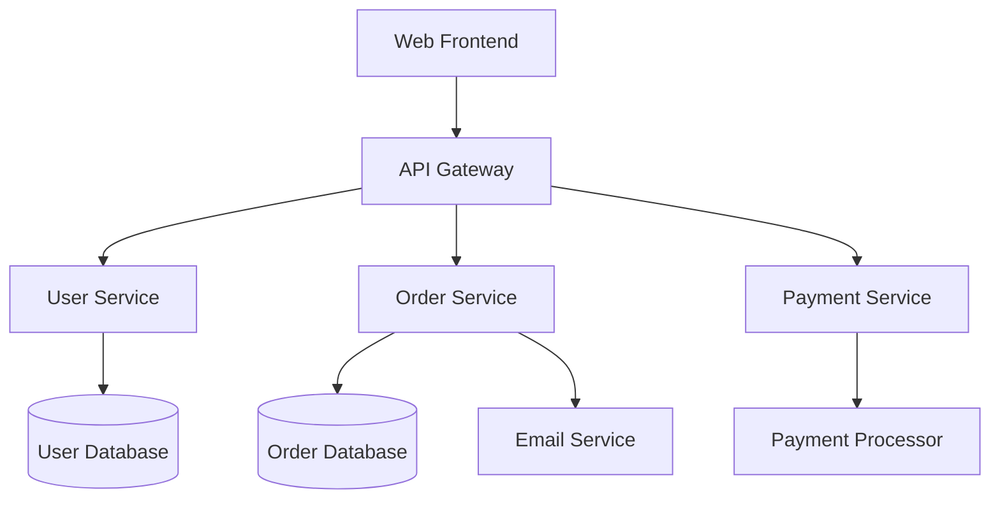

# Part I: Foundations and Assessment

## Chapter 1: The Legacy Code Reality

### What Makes Code "Legacy"

Legacy code isn't simply old code. It's code that has accumulated layers of complexity, accumulated technical debt, and often exists in a state where making changes feels risky and unpredictable. Michael Feathers defined legacy code as "code without tests," but in the age of AI-assisted development, we can expand this definition to include code that lacks clear understanding, documentation, and maintainable structure.

#### The Modern Legacy Landscape

Today's legacy systems often exhibit several key characteristics:

**Knowledge Decay**: The original developers have moved on, taking with them crucial understanding of design decisions, business rules, and architectural choices. This creates what we call "tribal knowledge gaps" – critical information that exists only in the minds of a few team members or, worse, nowhere at all.

**Documentation Debt**: Comments are outdated, README files are incomplete, and architectural documentation is either missing or contradicts the actual implementation. The gap between intention and reality grows wider over time.

**Fear-Driven Development**: Teams become hesitant to make changes because they can't predict the impact. This leads to workarounds, patches, and band-aid solutions that further complicate the system.

**Technology Obsolescence**: Frameworks, libraries, and platforms become outdated, security vulnerabilities accumulate, and the gap between current best practices and the existing codebase widens.

#### The Compound Effect of Technical Debt

Technical debt compounds like financial debt. A quick fix today becomes a bigger problem tomorrow. When teams consistently choose expedient solutions over proper ones, the codebase becomes increasingly difficult to work with. Each change becomes riskier, development velocity slows, and the system becomes more brittle.

Consider a typical scenario: A critical bug needs fixing in production. Under pressure, the team implements a quick workaround rather than addressing the root cause. This workaround requires additional code to handle edge cases, which in turn requires more workarounds. Six months later, what should have been a simple feature addition requires understanding and working around a maze of interconnected patches.

### The AI Advantage in Legacy Systems

Artificial Intelligence fundamentally changes how we approach legacy code. Where traditional approaches rely heavily on human analysis and intuition, AI can process vast amounts of code, identify patterns, and provide insights that would take human developers weeks or months to discover.

#### Pattern Recognition at Scale

AI excels at identifying patterns in large codebases. It can:

- Recognize common anti-patterns and code smells across thousands of files
- Identify similar code blocks that could be refactored into reusable components
- Detect inconsistent coding styles and naming conventions
- Find potential security vulnerabilities based on known patterns

For example, when analyzing a legacy system, an AI tool might identify that the same database connection logic is repeated in 47 different files with slight variations. A human reviewer might miss this pattern or take days to catalog all instances, while AI can identify and categorize them in minutes.

#### Automated Context Building

One of the biggest challenges with legacy code is understanding context – why was this code written this way? What business rules does it implement? How does it fit into the larger system?

AI can help build this context by:

- Analyzing code structure to infer business logic
- Generating documentation from code comments and variable names
- Identifying data flow and dependencies
- Creating visual representations of system architecture

#### Risk Assessment and Impact Analysis

Before making any changes to legacy code, you need to understand the potential impact. AI can analyze:

- Which parts of the system are most fragile or complex
- What dependencies exist between components
- Which changes are likely to have the highest risk
- What areas of the code have the most frequent bugs

This analysis helps teams prioritize their modernization efforts and approach changes with appropriate caution.

### Building Your AI-Assisted Toolkit

Successfully working with legacy code using AI requires the right tools and approaches. Your toolkit should include both AI-powered tools and traditional development tools that work well together.

#### Essential AI Tools for Legacy Work

**Code Analysis Tools**:
- **GitHub Copilot** and **ChatGPT/Claude** for code explanation and documentation
- **DeepCode** (now part of Snyk) for automated code review and vulnerability detection
- **Sourcery** for Python code quality and refactoring suggestions
- **Amazon CodeGuru** for performance optimization recommendations

**Documentation Tools**:
- **AI-powered documentation generators** that can create README files, API documentation, and code comments
- **Mermaid diagram generators** that create flowcharts and architecture diagrams from code analysis
- **Natural language processing tools** that can extract business rules from comments and variable names

**Analysis and Visualization Tools**:
- **Dependency analysis tools** that use AI to understand complex relationships
- **Code complexity analyzers** that identify problematic areas
- **Architecture visualization tools** that can create system diagrams from code structure

#### Setting Up Your Development Environment

Your development environment needs to support both AI tools and traditional legacy code work:

**IDE Integration**: Modern IDEs like VS Code, IntelliJ IDEA, and others now offer extensive AI plugin ecosystems. Configure these to work with your specific technology stack and coding standards.

**Version Control Integration**: Set up AI-powered code review tools that integrate with your Git workflow. These can automatically flag potential issues before code is merged.

**Documentation Pipeline**: Establish automated documentation generation that runs as part of your CI/CD pipeline, ensuring documentation stays current with code changes.

**Testing Infrastructure**: Implement AI-assisted testing tools that can generate test cases and identify areas lacking test coverage.

#### Creating Effective Prompts for Code Analysis

Working effectively with AI requires learning to ask the right questions in the right way. This is particularly important when analyzing legacy code, where context and nuance matter greatly.

**Effective Prompting Strategies**:

1. **Provide Context**: Always include relevant context about the business domain, technology stack, and specific concerns.

   *Poor prompt*: "What does this code do?"
   
   *Better prompt*: "This is a payment processing function in a legacy e-commerce system built with PHP 5.6. The original developers are no longer available. Can you explain what this code does, identify potential security issues, and suggest how it might be safely refactored?"

2. **Be Specific About Goals**: Clearly state what you're trying to achieve.

   *Poor prompt*: "Make this code better."
   
   *Better prompt*: "I need to add a new payment method to this system. Can you analyze the current payment processing code, identify the extension points, and suggest how to add a new payment method without breaking existing functionality?"

3. **Ask for Alternatives**: AI can generate multiple approaches to solving the same problem.

   "Can you suggest three different approaches to refactoring this monolithic function into smaller, testable components? Please include the pros and cons of each approach."

4. **Request Step-by-Step Plans**: For complex refactoring, ask for detailed, incremental approaches.

   "I need to migrate this database access code from direct SQL to use an ORM. Can you provide a step-by-step migration plan that allows us to make the change incrementally without breaking existing functionality?"

## Chapter 2: Understanding Your Legacy Codebase with AI

Before you can effectively work with legacy code, you need to understand what you're working with. This chapter focuses on using AI to rapidly build understanding of complex, unfamiliar codebases.

### AI-Powered Code Archaeology

Code archaeology is the process of uncovering the history, structure, and purpose of existing code. Traditional code archaeology relies on manual code reading, documentation review, and interviews with team members. AI-powered code archaeology can accelerate this process dramatically.

#### Understanding Unfamiliar Code Patterns

When you encounter a legacy codebase for the first time, you're often faced with unfamiliar patterns, outdated frameworks, and coding styles that may no longer be common. AI can help you quickly understand these patterns.

**Practical Example**: Imagine you're working with a legacy Java application that uses a custom framework built in 2008. The codebase contains patterns and abstractions that aren't immediately familiar. Here's how you might use AI to understand it:

```
Prompt: "I'm looking at a legacy Java codebase that appears to use a custom MVC framework. Here's a sample controller class [paste code]. Can you:
1. Explain the framework pattern being used
2. Identify the key abstractions and their purposes
3. Compare this to modern frameworks like Spring Boot
4. Highlight any potential issues or anti-patterns"
```

The AI can quickly identify that this is a custom implementation of the Front Controller pattern, explain how request routing works, and point out potential issues like tight coupling or lack of dependency injection.

#### Automated Dependency Mapping

Understanding dependencies is crucial for legacy systems. AI can help create comprehensive dependency maps that would take humans weeks to compile manually.

**Dependency Analysis Process**:

1. **Direct Dependencies**: AI can scan import statements, configuration files, and build scripts to identify explicit dependencies.

2. **Indirect Dependencies**: More sophisticated analysis can identify implicit dependencies through data flow analysis and method call graphs.

3. **External Dependencies**: AI can identify external services, databases, and APIs that the system depends on.

4. **Circular Dependencies**: AI excels at identifying circular dependencies that can make refactoring difficult.

**Example Analysis Output**:
```
System Dependencies Analysis:
- 247 internal classes with 89 circular dependencies
- 42 external libraries (15 with known security vulnerabilities)
- 7 database connections (3 appear to be redundant)
- 12 external API calls (4 with no error handling)
- 23 configuration files across 6 different formats
```

#### Historical Change Analysis with AI Insights

AI can analyze Git history to understand how the codebase has evolved over time, identifying patterns in how changes are made and where problems typically occur.

**Change Pattern Analysis**:
- Which files change together most frequently?
- What areas of the code have the highest churn?
- Which components have the most bug fixes?
- What patterns exist in how features are typically implemented?

This analysis helps identify:
- **Hotspots**: Areas of code that change frequently and may need refactoring
- **Stable Components**: Well-designed components that rarely need changes
- **Risky Areas**: Components with high bug rates or frequent emergency fixes

### Documentation Generation Strategies

Good documentation is essential for working with legacy code, but legacy systems often have poor or outdated documentation. AI can help generate comprehensive documentation quickly and keep it up to date.

#### AI-Generated Code Comments and README Files

AI can analyze code and generate appropriate comments and documentation:

**Code Comment Generation**:
```python
# Original code (no comments)
def calculate_price(base_price, customer_type, quantity, region):
    if customer_type == "PREMIUM":
        discount = 0.15
    elif customer_type == "STANDARD":
        discount = 0.05
    else:
        discount = 0
    
    if quantity > 100:
        discount += 0.1
    
    regional_multiplier = {"US": 1.0, "EU": 1.2, "ASIA": 0.9}.get(region, 1.0)
    
    return base_price * (1 - discount) * regional_multiplier * quantity

# AI-generated comments
def calculate_price(base_price, customer_type, quantity, region):
    """
    Calculate the final price for a customer order including discounts and regional adjustments.
    
    Args:
        base_price (float): Base price per unit
        customer_type (str): Customer tier ("PREMIUM", "STANDARD", or other)
        quantity (int): Number of units ordered
        region (str): Customer's region code ("US", "EU", "ASIA", or other)
    
    Returns:
        float: Final calculated price including all adjustments
    
    Business Rules:
        - Premium customers get 15% discount, Standard customers get 5%
        - Orders over 100 units get additional 10% discount
        - Regional pricing: EU +20%, Asia -10%, US baseline
    """
    # Apply customer tier discount
    if customer_type == "PREMIUM":
        discount = 0.15  # Premium tier: 15% discount
    elif customer_type == "STANDARD":
        discount = 0.05  # Standard tier: 5% discount
    else:
        discount = 0     # No discount for other customer types
    
    # Apply volume discount for large orders
    if quantity > 100:
        discount += 0.1  # Additional 10% for orders over 100 units
    
    # Apply regional pricing multiplier
    regional_multiplier = {
        "US": 1.0,    # Baseline pricing
        "EU": 1.2,    # 20% premium for EU market
        "ASIA": 0.9   # 10% discount for Asian market
    }.get(region, 1.0)  # Default to baseline for unknown regions
    
    return base_price * (1 - discount) * regional_multiplier * quantity
```

**README Generation**:
AI can analyze an entire codebase and generate comprehensive README files that include:
- Project overview and purpose
- Architecture description
- Setup and installation instructions
- Usage examples
- API documentation
- Contributing guidelines

#### Architecture Diagrams from Code Analysis

Visual documentation is often more valuable than text for understanding complex systems. AI can generate various types of diagrams:

**System Architecture Diagrams**:


**Data Flow Diagrams**:
AI can trace how data moves through the system and create visual representations of these flows.

**Dependency Graphs**:
Visual representations of how components depend on each other, making it easier to understand the impact of changes.

#### Business Logic Extraction and Documentation

One of the most valuable applications of AI in legacy systems is extracting and documenting business rules that are embedded in code.

**Example Business Rule Extraction**:

```python
# Original complex business logic
def calculate_shipping_cost(weight, distance, customer_tier, delivery_speed):
    base_cost = weight * 0.1
    if distance > 500:
        base_cost *= 1.5
    if customer_tier == "GOLD":
        base_cost *= 0.8
    elif customer_tier == "SILVER":
        base_cost *= 0.9
    if delivery_speed == "EXPRESS":
        base_cost *= 2.0
    elif delivery_speed == "OVERNIGHT":
        base_cost *= 3.0
    return max(base_cost, 5.0)
```

**AI-Generated Business Rule Documentation**:
```
Shipping Cost Calculation Rules:

Base Calculation:
- Base cost = weight (lbs) × $0.10

Distance Adjustments:
- Orders over 500 miles: +50% surcharge

Customer Tier Discounts:
- Gold tier: 20% discount
- Silver tier: 10% discount
- Standard tier: No discount

Delivery Speed Multipliers:
- Standard: No additional cost
- Express: 2× base cost
- Overnight: 3× base cost

Minimum Cost:
- All orders have a minimum shipping cost of $5.00

Example: 10 lb package, 600 miles, Gold customer, Express delivery
= 10 × $0.10 × 1.5 (distance) × 0.8 (Gold) × 2.0 (Express)
= $2.40 (but minimum $5.00 applies)
= $5.00 final cost
```

### Risk Assessment and Hotspot Identification

Not all legacy code is equally risky. Some parts of the system are stable and well-designed, while others are fragile and prone to problems. AI can help identify which areas need the most attention.

#### AI-Driven Complexity Metrics

AI can calculate various complexity metrics and identify patterns that indicate problematic code:

**Cyclomatic Complexity**: Measures the number of independent paths through code. High complexity indicates code that's difficult to test and understand.

**Coupling Analysis**: Identifies how tightly connected different parts of the system are. High coupling makes changes risky.

**Cohesion Analysis**: Measures how well the elements of a module work together. Low cohesion indicates poor design.

**Code Duplication Detection**: Finds repeated code patterns that could be refactored into reusable components.

#### Identifying Fragile Code Sections

AI can identify code that is likely to be fragile based on various indicators:

**Change Frequency**: Code that changes frequently may indicate design problems or evolving requirements.

**Bug Density**: Areas with high numbers of historical bugs are likely to have more bugs in the future.

**Test Coverage**: Code with low test coverage is riskier to change.

**Complexity vs. Documentation**: Complex code with little documentation is particularly risky.

**Example Risk Assessment Report**:
```
High-Risk Areas Identified:

1. OrderProcessing.java (Risk Score: 9.2/10)
   - Cyclomatic complexity: 47 (threshold: 10)
   - Test coverage: 12%
   - 23 bug fixes in the last 6 months
   - Last significant refactoring: 3 years ago
   - Recommendation: Priority 1 for refactoring

2. PaymentHandler.php (Risk Score: 8.7/10)
   - 347 lines in a single method
   - No error handling for 7 external API calls
   - Handles 12 different payment types in one function
   - Security vulnerabilities detected: 3
   - Recommendation: Urgent security review required

3. UserDataMigration.py (Risk Score: 7.9/10)
   - Direct database manipulation with no transactions
   - No rollback capability
   - Used in 15 different migration scripts
   - Last tested: Unknown
   - Recommendation: Create safe migration framework
```

#### Prioritizing Refactoring Efforts

With limited time and resources, teams need to prioritize which parts of the legacy system to work on first. AI can help create a prioritized refactoring plan based on:

**Business Impact**: How critical is this code to business operations?
**Risk Level**: How likely is this code to cause problems?
**Refactoring Effort**: How much work would it take to improve this code?
**Dependencies**: How many other parts of the system depend on this code?

**Prioritization Matrix Example**:
```
Refactoring Priority Matrix:

High Impact, High Risk, Low Effort:
- User authentication module
- Session management
- Configuration loading

High Impact, High Risk, High Effort:
- Order processing pipeline
- Payment integration
- Database access layer

High Impact, Low Risk, Low Effort:
- Logging framework
- Error handling utilities
- Input validation

Low Impact, High Risk, Low Effort:
- Legacy report generators
- Unused API endpoints
- Debug utilities
```

This systematic approach to understanding legacy code with AI provides teams with the foundation they need to make informed decisions about modernization efforts. In the next part, we'll explore how to use this understanding to safely transform legacy systems.